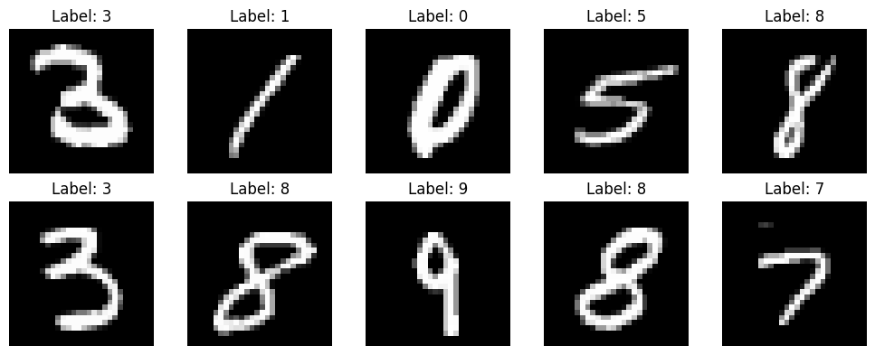
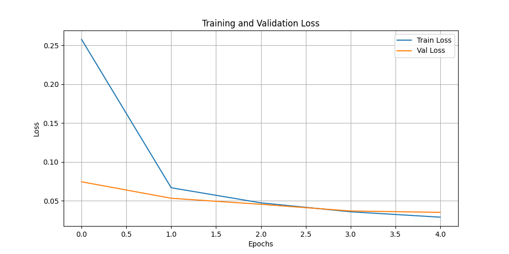
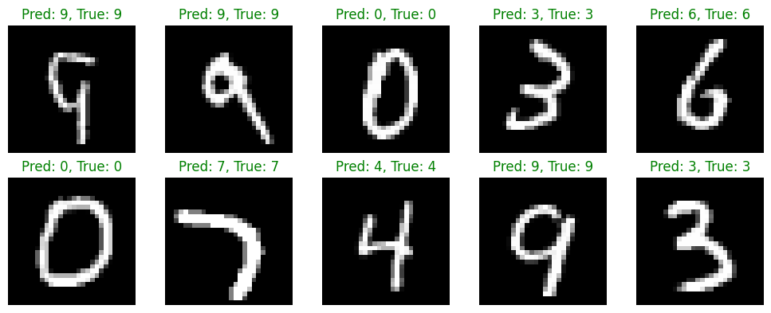
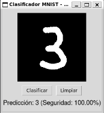
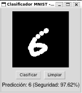
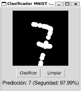
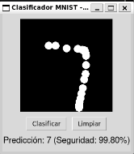

# PyTorch: Entrenamiento y Validación del Modelo IA

Este directorio contiene la fase preparatoria y de laboratorio para el Trabajo de Fin de Grado (TFG) centrado en la comparativa de orquestación distribuida (Systemd vs Kubernetes).

Antes de desplegar la arquitectura Master-Worker, en esta fase se ha diseñado, entrenado y validado el modelo de Inteligencia Artificial (una Red Neuronal Convolucional) encargado de clasificar dígitos manuscritos del dataset MNIST. 

Url del dataset MNIST: https://pythonguides.com/pytorch-mnist/

---

## Estructura del Proyecto

```text
Setmana5_PyTorch/
 ┣ data/                    # Directorio de descarga automática del dataset MNIST
 ┣ experiments/             # Historial automático de experimentos de entrenamiento
 ┃ ┣ exp_20260618_150618/   # Ejecución específica (Timestamp)
 ┃ ┃ ┣ best_model.pth       # Pesos del mejor modelo de esa ejecución
 ┃ ┃ ┣ loss_curve.png       # Gráfica de entrenamiento (Train vs Val Loss)
 ┃ ┃ ┗ metrics.json         # Métricas finales (Accuracy, Loss, Epochs)
 ┃ ┗ exp_20260618_151143/   # Siguientes experimentos...
 ┣ interact.py              # Interfaz gráfica (Tkinter) para probar el modelo en vivo
 ┗ train-model.ipynb        # Jupyter Notebook principal con la lógica de entrenamiento

```
---

## Instalación y Puesta en Marcha

Para ejecutar este proyecto de forma aislada y segura, es necesario configurar un entorno virtual y descargar las dependencias. Sigue estos pasos desde la raíz del proyecto:

1. **Crear el entorno virtual:**
    ```bash
    python3 -m venv .venv
    ```

2. **Activar el entorno virtual:**
* En Linux o macOS: `source .venv/bin/activate`
* En Windows: `.venv\Scripts\activate`
* *(Sabrás que está activado si ves `(.venv)` al principio de tu línea de comandos).*

3. **Instalar las dependencias requerides:**
    ```bash
    pip install requirements.txt
    ```

---

## 1. Entrenamiento del Modelo (`train-model.ipynb`)

El archivo `train-model.ipynb` constituye el entorno de laboratorio y el núcleo de la fase de Inteligencia Artificial de este proyecto. En él se ha implementado el *pipeline* completo de Machine Learning utilizando el *framework* PyTorch, abarcando desde la ingesta de datos hasta la exportación del modelo final. A continuación, se detallan las fases clave de este proceso:

### 1.1 Preparación y Procesamiento de Datos

Para el entrenamiento de la red, se ha utilizado el estándar de la industria para pruebas de visión artificial: el dataset **MNIST**, compuesto por imágenes en escala de grises de 28x28 píxeles de dígitos escritos a mano.
Antes de alimentar la red neuronal, los datos pasan por una fase de preprocesamiento mediante la librería `torchvision.transforms`:

* Se convierten las imágenes en estructuras de tensores (`ToTensor()`).
* Se aplica una **Normalización** estandarizada utilizando la media (0.1307) y la desviación estándar (0.3081) globales del dataset original, lo cual acelera y estabiliza la convergencia del entrenamiento.

Una decisión de diseño crítica en esta fase ha sido la creación manual de un **Conjunto de Validación**. Dado que MNIST proporciona por defecto solo conjuntos de *Train* y *Test*, se ha aplicado la función `random_split` de PyTorch para segmentar dinámicamente las 60.000 imágenes de entrenamiento en un **80% (48.000 imágenes) para el entrenamiento puro** y un **20% (12.000 imágenes) para la validación**. Esta separación mutuamente excluyente es fundamental para garantizar que el modelo no vea los datos de validación durante el cálculo del gradiente, evitando así el problema de la "Fuga de Datos" (*Data Leakage*) y permitiendo evaluar el modelo de forma objetiva al final de cada época.



### 1.2 Arquitectura de la Red Neuronal (CNN)

En lugar de optar por un perceptrón multicapa básico, se ha diseñado una **Red Neuronal Convolucional (CNN)** personalizada, ya que estas arquitecturas son muy superiores para tareas de procesamiento de imágenes al aprovechar la correlación espacial de los píxeles.
La arquitectura se divide en dos bloques principales:

1. **Bloque de Extracción de Características:** Compuesto por dos capas convolucionales (`Conv2d`). La primera extrae 32 mapas de características y la segunda 64. Cada convolución va seguida de una función de activación no lineal **ReLU** y una capa de agrupación **MaxPool2d** (para reducir la dimensionalidad y el coste computacional). Para dotar al modelo de robustez frente al sobreajuste (*Overfitting*), se ha inyectado una capa de regularización **Dropout** con una probabilidad del 25%, la cual "apaga" neuronas aleatoriamente durante el entrenamiento, forzando a la red a generalizar en lugar de memorizar.
2. **Bloque de Clasificación:** Tras aplanar los mapas de características resultantes (`view`), la información pasa por dos capas densas (*Fully Connected* o `Linear`), que reducen las dimensiones hasta una salida final de 10 nodos, correspondientes a las probabilidades de los 10 dígitos posibles (0-9).

### 1.3 Entrenamiento y *Experiment Tracking* (MLOps)

El proceso de optimización de los pesos de la red se realiza mediante el algoritmo de Descenso de Gradiente Estocástico (**SGD**), configurado con una tasa de aprendizaje de 0.01 y un momentum de 0.9, utilizando como función de coste la Entropía Cruzada (*CrossEntropyLoss*). Se ha establecido un bucle de entrenamiento de 5 épocas, utilizando un tamaño de lote (*batch size*) de 64 imágenes.

Para asegurar la trazabilidad y reproducibilidad del proyecto a nivel de software, se han introducido prácticas de **Experiment Tracking**. Cada vez que se ejecuta el código, el sistema no sobrescribe modelos anteriores, sino que genera automáticamente un directorio aislado cuyo nombre es un *timestamp* único (ej. `exp_YYYYMMDD_HHMMSS`). Dentro de este ecosistema se almacenan tres artefactos fundamentales:

* **El "Cerebro" (`best_model.pth`):** El archivo binario con los pesos óptimos. El código evalúa la pérdida de validación en cada época y solo guarda el modelo si mejora la métrica anterior (`best_val_loss`).
* **La Gráfica de Convergencia (`loss_curve.png`):** Una visualización automática de la evolución comparativa del *Train Loss* frente al *Val Loss*.
* **Las Métricas (`metrics.json`):** Un archivo estructurado que registra el número de épocas, la precisión lograda y los valores de pérdida finales, facilitando la auditoría de cada prueba.



### 1.4 Evaluación y Resultados

Al finalizar el entrenamiento, el mejor modelo exportado se somete a la prueba definitiva de inferencia usando el **Conjunto de Test** original, compuesto por 10.000 imágenes estrictamente aisladas del resto del ciclo de vida de los datos.

Los resultados demuestran la eficacia de la arquitectura diseñada, logrando consistentemente una precisión matemática (Accuracy) superior al **98.5%** (alcanzando cifras en torno al 98.9% en varios de los experimentos registrados). Esta tasa de éxito, junto con una curva de pérdida convergente sin signos de *overfitting*, confirma que el modelo generaliza de forma excelente y constituye un componente lógico altamente capaz para ser empaquetado, distribuido y orquestado por los nodos *Worker* en las siguientes fases del proyecto basadas en Systemd y Kubernetes.



---

## 2. Prueba Interactiva (`interact.py`)

Para validar que el modelo entrenado en la fase anterior posee capacidad de generalización fuera del entorno controlado del dataset MNIST, se ha desarrollado una aplicación interactiva en Python denominada `interact.py`. Este script permite la interacción humana con el modelo mediante una interfaz gráfica, proporcionando una demostración tangible de la inferencia en tiempo real.

### 2.1 Arquitectura del Script

El código se articula en tres capas claramente diferenciadas para asegurar un flujo de trabajo eficiente:

* **Capa de Modelo:** El script replica la arquitectura CNN definida en la fase de entrenamiento. Para realizar la inferencia, carga los pesos optimizados desde el archivo `best_model.pth` generado en el proceso de entrenamiento y coloca el modelo en modo de evaluación (`model.eval()`), desactivando comportamientos como el *Dropout* para obtener predicciones deterministas.
* **Capa de Interfaz de Usuario (UI):** Se ha utilizado la librería `tkinter` para crear una ventana que contiene un lienzo (`Canvas`) de 200x200 píxeles. Esta interfaz captura los eventos de movimiento del ratón (`<B1-Motion>`), permitiendo al usuario dibujar trazos libres que son representados inmediatamente en pantalla.
* **Capa de Procesamiento en Memoria:** Paralelamente al dibujo en la UI, los trazos se capturan en un objeto de imagen de la librería `PIL` (Python Imaging Library). Esta técnica de "doble registro" permite manipular la imagen directamente en memoria, evitando los problemas comunes de exportación y guardado de archivos temporales que ralentizarían la respuesta del sistema.

### 2.2 Pipeline de Inferencia

Cuando el usuario pulsa el botón de "Clasificar", se activa un *pipeline* de transformación idéntico al utilizado durante el entrenamiento, garantizando la consistencia de los datos:

1. **Transformación:** La imagen de 200x200 es redimensionada a 28x28 píxeles mediante un filtro de reescalado, convirtiéndola al formato esperado por la red.
2. **Conversión y Normalización:** Se convierte la imagen a un tensor de PyTorch y se aplica la misma normalización estadística utilizada en la fase de laboratorio, asegurando que la distribución de los valores de entrada sea coherente con la que el modelo aprendió a reconocer.
3. **Predicción:** El tensor se pasa por la CNN bajo un bloque `torch.no_grad()` (para optimizar memoria al no necesitar cálculo de gradientes) y se aplica la función `softmax` sobre la salida para convertir las activaciones de la red en probabilidades normalizadas. El script identifica el dígito con mayor probabilidad y muestra al usuario tanto el resultado como el nivel de seguridad (confianza) del modelo.

### 2.3 Importancia del test interactivo

La implementación de `interact.py` es crucial para esta fase previa por dos razones:

* **Validación de usuario:** Permite comprobar la robustez del modelo ante trazos con diferentes grosores, velocidades y estilos, confirmando que la red ha aprendido las características intrínsecas de los números y no simplemente patrones del dataset original.
* **Base para la inferencia distribuida:** Este script representa la lógica de "Worker" final. En las próximas fases del TFG, la función `classify()` será extraída y encapsulada dentro de los nodos *Worker* que recibirán las imágenes de forma remota, siendo esta la base sobre la que se medirá el rendimiento de la orquestación en Systemd y Kubernetes.

### 2.4 Ejecución del script

```bash
cd Setmana5_PyTorch
python interact.py
```

*(Nota: Asegúrate de copiar tu archivo `best_model.pth` elegido desde la carpeta `experiments/` a la raíz del directorio para que el script pueda cargarlo).*

### 2.5 Ejemplo de resultados obtenidos






---

## Próximos Pasos en el TFG

Con el "cerebro" de la IA validado y empaquetado, el proyecto avanza hacia el desacoplamiento de este código en una **arquitectura distribuida**:

* **Nodo Master:** Orquestador encargado de entrenar modelo y distribuir el archivo `.pth` y enviar lotes de imágenes sin clasificar.
* **Nodos Worker:** Nodos de computo que reciben el modelo en memoria, realizan la inferencia y devuelven los resultados al Master.
* **Orquestación y Comparativa:** Este flujo de red se desplegará utilizando **Systemd** y posteriormente **Kubernetes** para analizar y documentar las ventajas e inconvenientes de cada enfoque a nivel de infraestructura.
