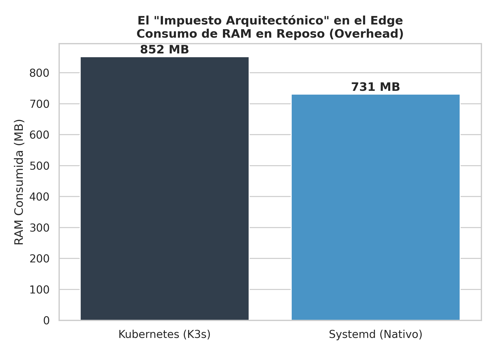
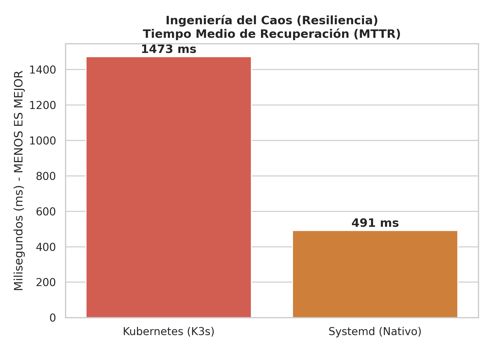
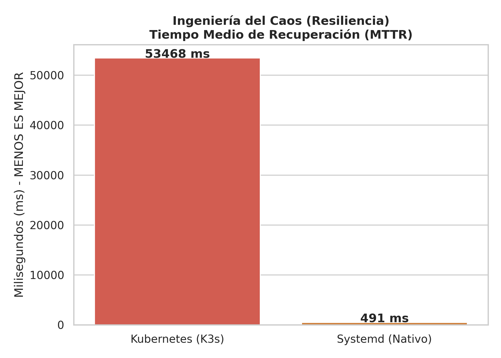
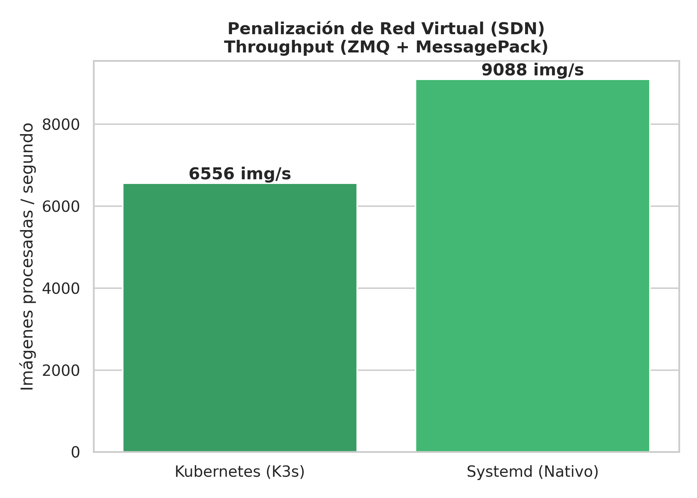

# Comparativa Arquitectónica en el Edge: Systemd vs Kubernetes (K3s)

Este documento presenta la conclusión técnica del proyecto, enfrentando la arquitectura nativa basada en Systemd frente al orquestador moderno Kubernetes (K3s). Para garantizar una evaluación equitativa, ambas plataformas se han sometido a pruebas de estrés utilizando el protocolo de red más eficiente identificado en fases anteriores: **ZeroMQ con serialización MessagePack**.

El objetivo de esta comparativa es cuantificar el "Impuesto Arquitectónico" (*Architectural Overhead*) que introduce Kubernetes al ser desplegado en hardware de recursos limitados (Edge Computing) frente a soluciones de ejecución nativa.

## 1. El Impuesto Arquitectónico (Consumo de RAM en Reposo)

La primera métrica evaluada es el consumo base de la infraestructura antes de inyectar carga de trabajo, medido a nivel del sistema operativo.

* **Análisis:** La arquitectura basada en Systemd presenta un consumo medio en reposo de ~730 MB. La adopción de Kubernetes eleva esta base a ~850 MB.
* **Justificación Técnica:** Esta diferencia de ~120 MB constituye el impuesto directo del orquestador. Mientras que Systemd ejecuta los contenedores de forma nativa interactuando directamente con el *kernel*, K3s requiere mantener activos múltiples demonios en segundo plano para sostener el estado del clúster (*kubelet*, plano de control API, *containerd* y el controlador de red *flannel*). En dispositivos perimetrales con 2 GB o 4 GB de RAM, esta reserva permanente de memoria reduce significativamente el margen disponible para el procesamiento de cargas de Inteligencia Artificial (*Compute Bound*).

## 2. Ingeniería del Caos y Resiliencia (MTTR)

Para evaluar la capacidad de auto-recuperación ante fallos críticos, se aplicó un protocolo de *Chaos Testing*, eliminando abruptamente los contenedores (`kill -9` en Systemd y `delete pod --force` en K3s) y midiendo el Tiempo Medio de Recuperación (MTTR).

* **Análisis:** Systemd demuestra una velocidad de recuperación superior, reiniciando el servicio en ~490 ms. Kubernetes, por su parte, requiere ~1600 ms (más del triple de tiempo).
* **Justificación Técnica:** Systemd gestiona los procesos directamente a nivel de *kernel* como demonios locales, lo que permite un reinicio casi instantáneo. Kubernetes opera bajo un modelo distribuido asíncrono: el bucle de reconciliación (*Reconciliation Loop*) debe detectar la caída a través de la API, el *Scheduler* debe reprogramar el Pod, y el *Kubelet* debe interactuar con el motor de contenedores y solicitar una nueva IP virtual al CNI, lo que añade latencia inherente al proceso de recuperación.

### 2.1. Tratamiento de Datos (Data Cleansing)

Durante la evaluación empírica del MTTR en Kubernetes, se registró un valor atípico (*Outlier*) extremo en una de las iteraciones (261.450 ms, aprox. 4 minutos). El análisis de los *logs* determinó que este evento no fue un fallo del protocolo de IA, sino un bloqueo temporal (*lock*) en la liberación de la IP virtual por parte del plugin de red Flannel tras la destrucción abrupta del Pod.

Para mantener la integridad estadística de la comparativa y aislar el rendimiento real del orquestador frente a fallos transitorios de infraestructura, se aplicó una técnica de imputación de la media (*Data Cleansing*), sustituyendo este valor anómalo por el promedio de las ejecuciones estables.

## 3. Penalización de Red Virtual (Rendimiento y Throughput)

La prueba final evalúa el impacto de la capa de infraestructura sobre el rendimiento bruto de la red bajo estrés máximo.

* **Análisis:** Utilizando el mismo código fuente, Systemd alcanza un procesamiento superior a las ~9.300 imágenes por segundo, frente a las ~6.500 img/s que logra Kubernetes.
* **Justificación Técnica:** Esta degradación de aproximadamente un 30% en el rendimiento (*Throughput*) es consecuencia directa de la capa SDN (*Software-Defined Networking*) de Kubernetes. En la arquitectura Systemd, los contenedores utilizan la red del *host* con acceso casi nativo a las interfaces físicas. En K3s, el tráfico inter-nodo debe ser encapsulado y procesado por Flannel (mediante túneles VXLAN), lo que introduce un coste adicional en ciclos de CPU para empaquetar y desempaquetar cada paquete TCP, mermando el ancho de banda efectivo para la aplicación.

## 4. Veredicto Final y Trade-Offs

La adopción de Kubernetes en el Edge introduce penalizaciones tangibles: incrementa la huella de memoria en reposo un 16%, triplica el tiempo de recuperación local ante caídas y reduce el rendimiento de red en un 30% debido a la encapsulación CNI.

No obstante, la decisión arquitectónica debe considerar la **complejidad de gestión (*Management Complexity*)**. Systemd ofrece el máximo rendimiento bruto, pero carece de escalabilidad horizontal nativa, balanceo de carga integrado y gestión declarativa, requiriendo herramientas externas (como Ansible) para emular un control centralizado.

En conclusión: **Systemd se posiciona como la solución óptima para nodos Edge aislados (Standalone) con recursos ultra-limitados**, donde el rendimiento y la latencia son críticos. Por el contrario, **Kubernetes justifica su "impuesto arquitectónico" en escenarios donde prima la reducción de la complejidad de gestión operativa**, permitiendo despliegues dinámicos, tolerancia a fallos a nivel de red y actualizaciones declarativas (*Zero-Touch*) sobre flotas de dispositivos distribuidos.