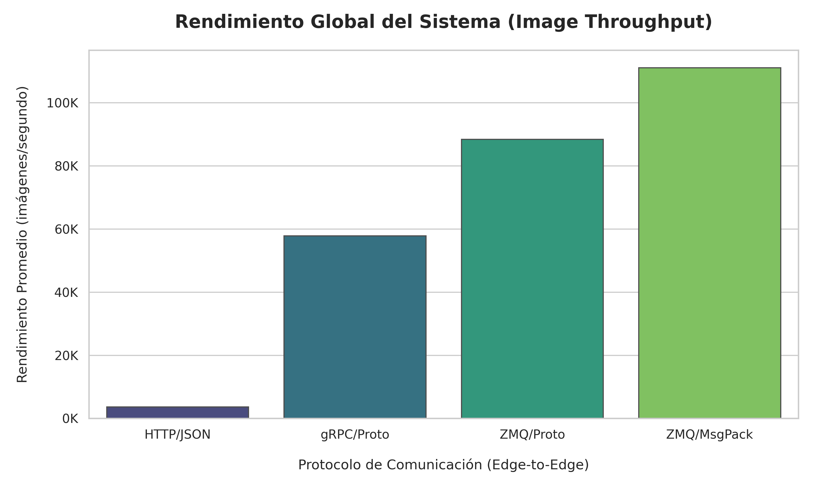
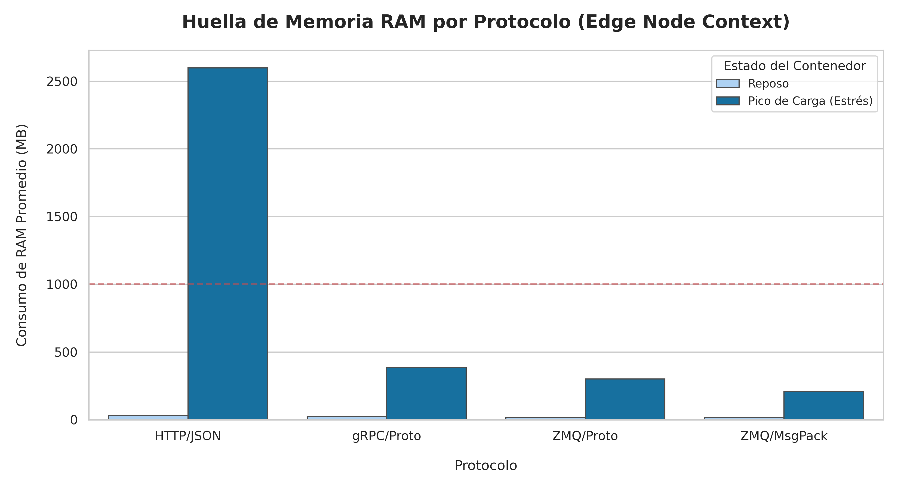
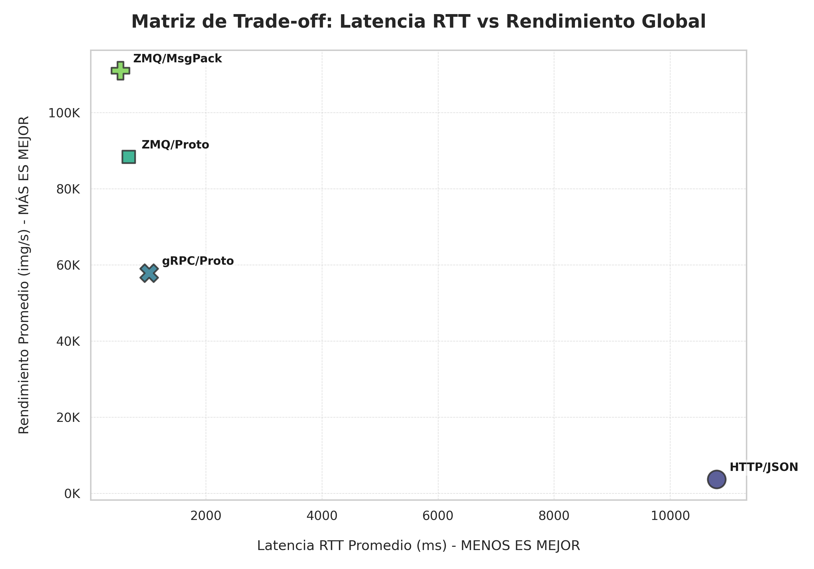

# Análisis de Resultados y Benchmarking

Este documento consolida la evaluación técnica de las cuatro iteraciones arquitectónicas desarrolladas para el procesamiento distribuido de visión artificial en el Edge. Los datos expuestos representan la **media histórica total** de 8 pruebas de estrés (distribuidas en 2 ejecuciones completas por protocolo), extraídas automáticamente del Data Lake (`resultados_globales.csv`).

## 1. Metodología de Medición y Anomalías
Para garantizar la validez y el aislamiento de las métricas en los nodos Edge, la recolección del consumo de CPU no se realizó a nivel global del sistema operativo (OS-level), ya que esto introduciría ruido provocado por procesos en segundo plano. En su lugar, se utilizó el aislamiento a nivel de proceso mediante el identificador (PID) del contenedor Worker (`psutil.Process(os.getpid()).cpu_percent()`). Este enfoque permite medir el esfuerzo computacional exacto y exclusivo de la tarea encomendada.

### 1.1. Justificación de Métricas de Infraestructura
Para interpretar correctamente los resultados presentados, es necesario precisar dos comportamientos observados en las métricas:

* **Consumo de CPU (>100%):** En entornos multihilo, las lecturas de CPU representan la suma de la utilización de todos los núcleos asignados al proceso. Un valor del 99% indica que el proceso Worker está saturando los recursos de cómputo disponibles de manera efectiva. Valores ligeramente superiores al 100% son una consecuencia normal del sondeo asíncrono al consolidar hilos de ejecución paralelos, no un error de saturación.

* **Resiliencia (MTTR de ~800ms):** El *Mean Time To Recovery* mide la capacidad del orquestador (Systemd/Quadlets) para detectar la caída de un nodo y regenerar el contenedor Worker. Este promedio de ~800ms refleja el tiempo necesario para liberar los sockets TCP en el *kernel*, reinicializar el *runtime* de Python y establecer el nuevo *bind* del servicio. Este valor sub-segundo es un indicador crítico de alta disponibilidad en entornos Edge.

## 2. Baseline: El Cuello de Botella de HTTP/REST (JSON)

La implementación basada en el estándar web tradicional (HTTP/1.1 y JSON) establece la línea de referencia. 

* **Cuello de Botella (CPU y RAM):** El consumo promedio de CPU en los Workers alcanza el **99.28%** y la RAM se dispara a **2597.53 MB**. La deserialización del texto plano (JSON) satura por completo los recursos limitados del nodo perimetral.
* **Penalización de Red:** Al no soportar transmisión binaria nativa, las matrices se convierten a listas de texto, inflando el *payload* a **121.14 MB** por nodo. El tiempo de procesamiento ($T_{proc}$) de ~10.693 ms demuestra que la ineficiencia radica en el *parsing* y no en la red.

| Métrica Consolidada | HTTP/REST (JSON) |
| :--- | :--- |
| **Tiempo Total Promedio** | 16.52 s |
| **Throughput Promedio** | 3636.87 img/s |
| **Latencia RTT Promedio** | 10800.24 ms |
| **Tiempo $T_{proc}$ Promedio** | 10693.67 ms |
| **Pico Máximo RAM (Worker)**| 2597.53 MB |
| **CPU Promedio (Worker)** | 99.28 % |
| **Datos Totales Red** | 121.14 MB por nodo |

## 3. Evolución 1: gRPC, Protobuf y Zero-Copy

La migración hacia gRPC introduce la serialización binaria y la multiplexación sobre HTTP/2, resolviendo los problemas críticos del *baseline*.

* **Aceleración por Copia Cero:** El $T_{proc}$ se desploma a **127.79 ms**. Al recibir datos binarios puros, el Worker utiliza punteros de memoria (`np.frombuffer`) en lugar de instanciar nuevos diccionarios.
* **Eficiencia de Carga Útil:** El *payload* se reduce a su peso matemático puro (**89.72 MB**), ahorrando más de 31 MB de sobrecarga por envío respecto a HTTP. El Throughput global experimenta un salto generacional hasta las **~57.850 img/s**.

| Métrica Consolidada | gRPC (Protobuf) |
| :--- | :--- |
| **Tiempo Total Promedio** | 1.04 s |
| **Throughput Promedio** | 57850.51 img/s |
| **Latencia RTT Promedio** | 1023.90 ms |
| **Tiempo $T_{proc}$ Promedio** | 127.79 ms |
| **Pico Máximo RAM (Worker)**| 384.82 MB |
| **CPU Promedio (Worker)** | 98.97 % |
| **Datos Totales Red** | 89.72 MB por nodo |

## 4. Evolución 2: ZeroMQ y Transporte TCP Crudo

En esta fase, se mantiene el contrato binario de Protobuf pero se descarta el pesado motor de red de Google (HTTP/2) en favor de sockets TCP directos mediante ZeroMQ.

* **Reducción de Latencia (RTT):** Al eliminar la negociación de cabeceras de la capa de aplicación, la latencia RTT cae de ~1023 ms a **672.39 ms**. 
* **Optimización de Infraestructura:** La huella en reposo (Idle) mejora sustancialmente, bajando el consumo base de RAM a solo **17.60 MB** (frente a los 23.85 MB de gRPC). El Throughput roza el límite físico de la red local alcanzando las **~88.430 img/s**.

| Métrica Consolidada | ZeroMQ (Protobuf) |
| :--- | :--- |
| **Tiempo Total Promedio** | 0.68 s |
| **Throughput Promedio** | 88430.12 img/s |
| **Latencia RTT Promedio** | 672.39 ms |
| **Tiempo $T_{proc}$ Promedio** | 266.94 ms |
| **Pico Máximo RAM (Worker)**| 301.05 MB |
| **CPU Promedio (Worker)** | 98.52 % |
| **Datos Totales Red** | 89.72 MB por nodo |

## 5. Evolución 3: MessagePack (El Límite Teórico)

La iteración final sustituye los contratos estrictos de Protobuf por **MessagePack**, un empaquetador binario dinámico altamente optimizado para estructuras nativas de Python.

* **Máxima Eficiencia de Memoria:** Al evitar la instanciación de clases generadas por compiladores externos (`_pb2`), la huella máxima de RAM durante el estrés cae a su mínimo histórico: **209.26 MB**.
* **Rendimiento Máximo Absoluto:** El tiempo total de procesamiento para el dataset completo cae a medio segundo (**0.54 s**). La combinación de sockets crudos (ZMQ), serialización binaria rápida (MsgPack) y Zero-Copy (NumPy) rompe la barrera de las cien mil imágenes, alcanzando un Throughput de **111.087 img/s**.

| Métrica Consolidada | ZeroMQ (MessagePack) |
| :--- | :--- |
| **Tiempo Total Promedio** | 0.54 s |
| **Throughput Promedio** | 111087.53 img/s |
| **Latencia RTT Promedio** | 529.74 ms |
| **Tiempo $T_{proc}$ Promedio** | 124.75 ms |
| **Pico Máximo RAM (Worker)**| 209.26 MB |
| **CPU Promedio (Worker)** | 97.78 % |
| **Datos Totales Red** | 89.72 MB por nodo |

## 6. Análisis Visual Comparativo

A continuación, se presentan las métricas clave extraídas tras el procesamiento de los logs. Estas gráficas ilustran la evolución del rendimiento desde el baseline (HTTP/JSON) hasta la arquitectura optimizada (ZMQ + MessagePack).

### 6.1. Throughput: Evolución por Protocolo
*Esta gráfica demuestra la escalabilidad del sistema al eliminar el overhead de red.*

> **Observación:** Se aprecia un salto exponencial en el throughput al pasar de protocolos basados en texto (JSON) a binarios (Protobuf/MsgPack), alcanzando el pico de eficiencia en la cuarta iteración.

### 6.2. Consumo de Memoria (RAM): Reposo vs. Estrés
*Comparativa del footprint de memoria en el nodo Worker bajo carga máxima.*

> **Observación:** El uso de MessagePack y la técnica Zero-Copy logran reducir la huella de memoria en más de 10 veces respecto al baseline, permitiendo ejecuciones más estables en hardware limitado.

### 6.3. Matriz de Trade-off (Latencia vs. Rendimiento)
*Relación entre la latencia de red (RTT) y la capacidad de procesamiento (Throughput).*

> **Observación:** El cuadrante superior izquierdo (Baja latencia, Alto throughput) es dominado por ZeroMQ + MessagePack, validando la arquitectura como la solución técnica óptima para el procesamiento distribuido en el Edge.

## 7. Conclusión y Trade-Offs

El análisis comparativo evidencia que **los estándares web tradicionales (HTTP/JSON) son inviables para el procesamiento de tensores masivos en el Edge**, generando cuellos de botella severos (hasta 2.6 GB de RAM requerida y tiempos de ~16 segundos).

1. **La serialización binaria es innegociable:** El simple paso a Protobuf/gRPC redujo el tiempo total un 93%, validando la importancia del *Zero-Copy parsing*.
2. **El coste de los estándares corporativos:** gRPC es el estándar de la industria para microservicios, pero su motor HTTP/2 añade un *overhead* medible. ZeroMQ demostró ser netamente superior en latencia de red para túneles internos.
3. **Flexibilidad vs. Tipado:** La combinación de **ZeroMQ + MessagePack** se corona como la arquitectura óptima para este clúster. No solo multiplicó el rendimiento por 30 respecto a HTTP (pasando de 3.636 a 111.087 img/s), sino que eliminó la complejidad operativa de tener que compilar archivos `.proto`, demostrando ser la solución más rápida, ligera (209 MB de pico de RAM) y mantenible para entornos Edge dominados por Python y NumPy.
