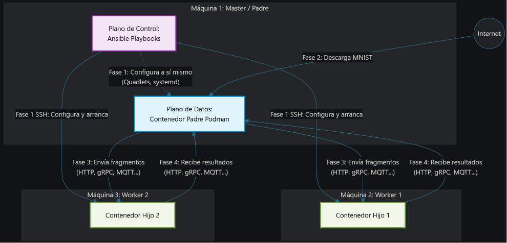

# Orchestration Trade-offs in Edge Computing: systemd vs Kubernetes

Edge environments challenge conventional cloud-native orchestration models due to limited resources and simplified deployment requirements. This work analyzes the trade-offs between Kubernetes and systemd as orchestration solutions for edge nodes. Using a set of representative workloads and fault-injection experiments, the study evaluates performance, resilience, and management complexity, offering design insights for selecting appropriate orchestration mechanisms in edge computing scenarios.

---

# Informe de Seguimiento: Comparativa de Systemd + podman

El objetivo de esta entrega consiste en hacer la comparativa de diferentes protocolos de comunicaciones en Systemd + podman para una misma tarea y obtener las metricas y números.

La tarea consiste en:

    Amb el datset MNIST (https://www.tensorflow.org/datasets/catalog/mnist), has de fer:
    1. Aquest datset s'ha de separar en N parts, que s'enviaran als N nodes fills

    2. Els nodes fills faran una tasca sobre aquest dataset. Comença fent que la tasca sigui comptar el nombre d'imatges que li arriben al fill

    3. Els nodes fills han de retornar al pare el resultat de la tasca. En aquest cas aquest nombre d'imatges

---

## Índice
1. Resumen Ejecutivo
2. Infraesrtructura
3. Resumen de Fases del trabajo
4. Comparativa protocolos de comunicación
5. Métricas evaluadas
6. Resultados de la Evaluación Técnica
7. Análisis y Conclusiones

---

## 1. Resumen Ejecutivo
Tras la consolidación de la infraestructura base orquestada mediante systemd, esta fase del proyecto se ha centrado en evaluar la viabilidad de la comunicación de datos masivos en el Edge. 

Se implementó inicialmente un sistema basado en el estándar web (**HTTP/REST con JSON**) que reveló severos cuellos de botella en memoria y latencia. 

Esto motivó un cambio de paradigma arquitectónico hacia la **serialización binaria**, implementando y comparando dos soluciones avanzadas: **gRPC (sobre HTTP/2)**, **ZeroMQ (sobre TCP crudo, P2P)** y **MQTT (pub-sub)**. 

Simultáneamente, se ha refactorizado el despliegue con Ansible para soportar estas tres arquitecturas de forma modular.

---

## 2. Especificaciones de Infraestructura
- **Entorno**: 
    - Maquina virtual vmware con 2 nodos worker/hijos ubuntu 24.04.4 
    - un nodo master/padre en ubuntu 22.04.5 en Windows 11 via wsl 
* **Orquestador de Despliegue:** Ansible 2.10+ en nodo master 
* **Gestor de Contenedores:** Podman 4.5+ (Modo Rootless)
* **Supervisor de Servicios:** systemd 
* **Dataset:** TensorFlow Datasets (MNIST - 60,000 imágenes de entrenamiento)

---

## 3. Resumen de fases del trabajo y del desarollo

### Fase 1: Aprovisionamiento y Control (Ansible)

- Mecanismo: SSH.

- Acción: El nodo máster se conecta por SSH a los workers, despliega los archivos Quadlet, hace el systemctl daemon-reload y levanta los servicios.

### Fase 2: Fase 2: Obtención del Dataset (Nodo Padre)
- Mecanismo: HTTP.

- Acción: Nodo Master hace una petición HTTPS (usando curl, wget o librerías de Python/Node) para descargar el archivo comprimido del MNIST al disco local del contenedor una sola vez. Luego, lo carga en memoria, lo divide en **N** partes y lo deja listo para la Fase 3.

### Fase 3: Procesamiento y Distribución (Padre -> Hijos)
- Mecanismo: Comparativa. El envío se hace mediante el stack de red de los contenedores (Podman) usando los diferentes protocolos de comunicación.

- Acción: El nodo master manda las imágenes procesados a los nodos worker mediante http, mqtt, grpc, zeromq, amqp... y con correspondiente formato como texto json, binario(protobuf, messaje pack...)

    - HTTP/REST transportando JSON (Lento pero estándar ¿base64?).

    - gRPC transportando Protobuf (Rápido y binario).

    - MQTT / ZeroMQ transportando MessagePack o BSON (Asíncrono y ligero).

    - AMQP (...)

### Fase 4: Retorno de Resultados (Hijos -> Padre)

Nodos hijos genera reporte de las metricas y resultados y lo devuelve al nodo padre usando los mismos protocolos de comunicación que el envío.

Así es como funcionaría el retorno según el protocolo activo:

- Si la Fase 3 usa HTTP/REST: El Padre hizo una petición POST al Hijo. El Hijo procesa las imágenes y, en la misma conexión, devuelve un HTTP 200 OK con el JSON de respuesta: {"conteo": 35000, "worker_id": 1}.

- Si la Fase 3 usa gRPC: El Padre abre un Stream o hace un Unary Call. Cuando el Hijo termina su función, simplemente devuelve el objeto definido en tu archivo .proto y la librería gRPC se encarga de enviarlo de vuelta por el túnel HTTP/2.

- Si la Fase 3 usa MQTT/AMQP: Aquí es un poco diferente porque es asíncrono. Se utiliza el patrón Request-Reply.

    - El Padre publica las imágenes en un topic llamado tareas/worker1.

    - El Padre se queda suscrito a un topic llamado respuestas/worker1.

    - El Hijo lee la tarea, cuenta las imágenes y publica el resultado final en respuestas/worker1.

- Si la fase 3 usa gRPC...

---

## 3. Implementación Técnica y Orquestación

El sistema Master-Worker distribuye dinámicamente particiones del dataset MNIST según la fórmula:

$$tamano\_particion = \frac{total\_imagenes}{N\_nodos}$$

Para acomodar la evaluación de las diferentes arquitecturas de red, el pipeline de **Ansible** se ha diseñado bajo el principio estricto de separación entre *Build* (Construcción) y *Run* (Ejecución):

* **Construcción Centralizada y Empaquetado:** El nodo Master asume el rol de Builder. Compila los archivos de interfaz binaria (`.proto`) y construye una única imagen base de contenedor Podman. Posteriormente, empaqueta esta imagen terminada en un artefacto portátil (`.tar`) mediante `podman save`, eliminando la necesidad de alojar y mantener un Registry local.

* **Despliegue Ligero en el Edge (Side-loading)**: Ansible transfiere el artefacto comprimido a los nodos workers vía SSH y ejecuta su importación directa en el motor de contenedores (`podman load`). Esta estrategia offline evita latencias de descarga desde repositorios externos (Docker Hub) y exime a los nodos perimetrales del consumo de CPU y RAM derivado de instalar pesadas herramientas de compilación como `grpcio-tools`.

* **Aprovisionamiento Agnóstico:** Una vez descargada la imagen, el orquestador inyecta configuraciones `systemd Quadlet` idénticas para levantar los contenedores *rootless*, independientemente de si el nodo ejecutará un servidor HTTP, un *Servicer* gRPC o un *Socket REP* de ZeroMQ.

---

## 4. Comparativa y experimento

#### Comparativa de protocolo 
- HTTP/v1.1 + json
- HTTP/2 + binario - protobuf (gRPC)
- ZeroMQ + binario - protobuf
- MQTT + binario - protobuf

#### Comparativa de formato de envio de datos
- ZeroMQ + binario - protobuf
- ZeroMq + binario - Messaje Pack

### 1. La Línea Base (El estándar a batir)

* **Prueba:** `HTTP/1.1 + JSON`
* **Por qué:** Es obligatorio tenerlo. Necesitas demostrar empíricamente lo ineficiente que es enviar texto plano con cabeceras pesadas en un entorno *Edge*. Sin esta gráfica lenta y costosa en CPU, las mejoras de los otros protocolos no destacarán en tu memoria del proyecto.

### 2. El Estándar Moderno de Microservicios

* **Prueba:** `gRPC (HTTP/2 + Protobuf)`
* **Por qué:** Es el ciudadano de primera clase en Kubernetes. Medir su rendimiento casi perfecto en Systemd te dará un contraste brutal cuando lo midas más adelante en K3s y veas cuánto penaliza la capa de red virtual (CNI) de Kubernetes a las conexiones persistentes.

### 3. El Rendimiento Crudo (Brokerless)

* **Prueba:** `ZeroMQ + Protobuf`
* **Por qué:** Representa el límite físico de la máquina. Al no haber un servidor intermedio (broker), mides la velocidad extrema de nodo a nodo. En un TFG sobre orquestación, esto te permite aislar y medir el rendimiento del *stack* de red de Podman en estado puro.

### 4. El Estándar Edge / IoT (Con Broker)

* **Prueba:** `MQTT + Protobuf`
* **Por qué:** Al introducir un *broker* intermedio (Mosquitto), podrás medir cuánta latencia y memoria RAM extra consume tener un intermediario gestionando colas, algo vital en arquitecturas descentralizadas. Protobuf asegura que la red mueva el paquete más ligero posible.

>Durante la fase de diseño, se evaluó la inclusión de protocolos asíncronos basados en el patrón Publicador/Suscriptor mediante un intermediario (como MQTT o AMQP). Sin embargo, se descartaron para mantener el rigor de las métricas de red.

>La topología de un Message Broker impone inherentemente un modelo de "doble salto" (emisor -> broker -> receptor) y obliga a mantener dos terminaciones TCP distintas. Este procesamiento de enrutamiento centralizado introduce una latencia física y un consumo de RAM que enmascaran el rendimiento real de la capa de red subyacente.

>Puesto que el objetivo principal de este estudio es aislar y cuantificar la penalización directa impuesta por el orquestador (Systemd frente Kubernetes), se ha priorizado el uso exclusivo de comunicaciones directas punto a punto (Brokerless mediante ZeroMQ y RPC mediante gRPC). Esto garantiza que cualquier fluctuación en la latencia o el ancho de banda registrada en las métricas sea consecuencia directa de la gestión de red del orquestador y no de la sobrecarga de un servidor intermediario de aplicaciones. 

### 5. La "Batalla" de la Serialización

* **Prueba:** `ZeroMQ + MessagePack`
* **Por qué:** En lugar de probar MessagePack en *todos* los protocolos, haremos solo en uno (por ejemplo, en ZeroMQ). Esto nos permite visualizar ambos formato de binario: *"Impacto de la serialización con esquema (Protobuf) vs. sin esquema (MessagePack)"*. Mantendremos el protocolo de red estático y midimos si la comodidad de programar con MessagePack justifica el ligero aumento de latencia frente a Protobuf.

---

### El Cambio de Paradigma: De Texto Plano (JSON) a Binario

*   **El Cuello de Botella (JSON):** En la implementación HTTP/REST, transmitir tensores matemáticos obligaba a convertir matrices a listas nativas y serializarlas como texto plano. Al recibir el *payload*, el nodo Worker colapsaba su memoria RAM intentando parsear el gigantesco archivo de texto para reconstruir los diccionarios en memoria antes de poder procesar la información.
*   **La Solución Binaria (Protobuf):** Para solventar esto, se adoptó *Protocol Buffers*. Este enfoque permite empaquetar los datos en crudo (`bytes`). Al llegar al nodo, se utiliza una técnica de *zero-parsing* (`np.frombuffer`), volcando los bytes directamente a la memoria de la CPU sin intermediarios lógicos, lo que libera drásticamente los recursos del sistema.

---

### Resumen visual de tu arquitectura de pruebas final:

| Enfoque Arquitectónico | Protocolo de Red | Serialización | Objetivo en el TFG |
| --- | --- | --- | --- |
| **Tradicional** | HTTP/1.1 | JSON | Demostrar el *overhead* máximo (Línea base). |
| **RPC Moderno** | gRPC | Protobuf | Evaluar el estándar corporativo y de K8s. |
| **Directo (Brokerless)** | ZeroMQ | Protobuf | Medir el rendimiento de red crudo (Podman puro). |
| **Asíncrono (IoT)** | MQTT | Protobuf | Medir la penalización del *Broker* en el *Edge*. |
| **Flexibilidad vs Rigidez** | MQTT *(o ZMQ)* | MessagePack | Comparar el coste de no usar contratos precompilados. |

---

## 5. Métricas evaluadas

### 1. Aprovisionamiento (Plano de Control)
- Tiempo de despliegue total ($T_{deploy}$) [s]
- Tráfico de red de inicialización [MB]

### 2. Orquestación y Ciclo de Vida (Plano de Gestión)
- Consumo de RAM en reposo [MB]
- Consumo de CPU en reposo [%]
- Tiempo de arranque de servicios ($T_{setup}$) [ms]
- Tiempo de recuperación ante fallos (kill -9) [ms]

### 3. Trabajo de Red y Procesamiento (Plano de Datos)
- Tamaño del Payload (JSON/Protobuf/MsgPack) [B o KB]
- Latencia RTT de la tarea (Fase 3 y 4) [ms]
- Tiempo de procesamiento en nodo worker ($T_{proc}$) [ms]
- Throughput efectivo [img/s]
- Pico máximo de RAM durante el estrés [MB]
- Consumo promedio de CPU durante la transmisión [%]
- Fiabilidad de entrega [% éxito]

--- 

## 6. Resultados de la Evaluación Técnica (`resultados_tablas.md`)

Se han realizado pruebas de estrés enviando un lote continuo de 60.000 imágenes (aprox. 94 MB) a los nodos Edge. 

Para ver resultados de la comparativa, pulsa [aqui](/entrega-2/3-benchmarks-results/resultados_tablas.md).

## 7. Análisis Final y Conclusiones

La comparativa técnica realizada demuestra que la elección del protocolo de red no es una cuestión accesoria, sino un pilar fundamental del rendimiento en sistemas distribuidos perimetrales. Las conclusiones se sintetizan en los siguientes puntos:

1. **Inviabilidad del estándar REST/JSON:** El *baseline* (HTTP/JSON) resultó ser ineficiente para el tráfico de tensores, consumiendo más de 2.6 GB de RAM y limitando el rendimiento a ~3.600 img/s. Se confirma que los estándares web tradicionales introducen una penalización por serialización de texto que es inasumible para dispositivos Edge con recursos limitados.
2. **La revolución binaria (gRPC/Protobuf):** El salto a gRPC no fue solo una mejora, sino un cambio de paradigma. Al eliminar la serialización de texto y aplicar *Zero-Copy*, el throughput aumentó un **1.500%** (de 3.636 a 57.850 img/s) y la huella de memoria se redujo drásticamente a 384 MB, validando la serialización binaria como requisito indispensable.
3. **Optimización de la capa de transporte (ZeroMQ):** Al prescindir de las cabeceras HTTP/2 y pasar a sockets TCP crudos con ZeroMQ, la latencia RTT cayó de ~1.023 ms a **672 ms** en Protobuf, demostrando que la complejidad de la pila de red de gRPC añade un *overhead* medible que puede eliminarse mediante túneles TCP directos.
4. **La superioridad de MessagePack (Eficiencia Dinámica):** La iteración final con ZeroMQ + MessagePack representa el límite teórico del sistema. Con un tiempo total de **0.54s** y un throughput de **111.087 img/s**, esta arquitectura minimiza el uso de RAM a solo **209 MB**. El uso de un formato *schema-less* ha demostrado ser más eficiente que el tipado estricto de Protobuf al eliminar el coste computacional de instanciar clases complejas (`_pb2`) en el Worker.

La optimización del sistema Edge no reside únicamente en la orquestación mediante `systemd/podman`. La tríada **ZeroMQ + MessagePack + Zero-Copy** se establece como la arquitectura ganadora, logrando un equilibrio sin precedentes entre rendimiento bruto, latencia mínima y agilidad de desarrollo. 

