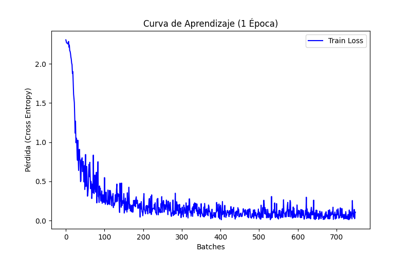
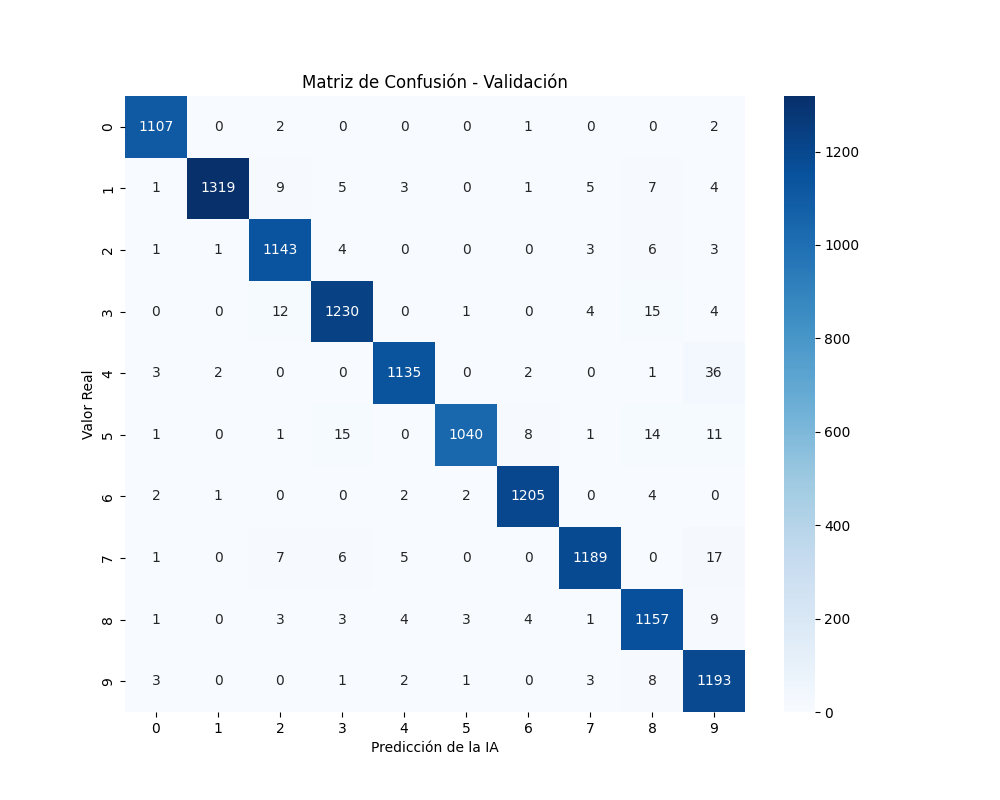
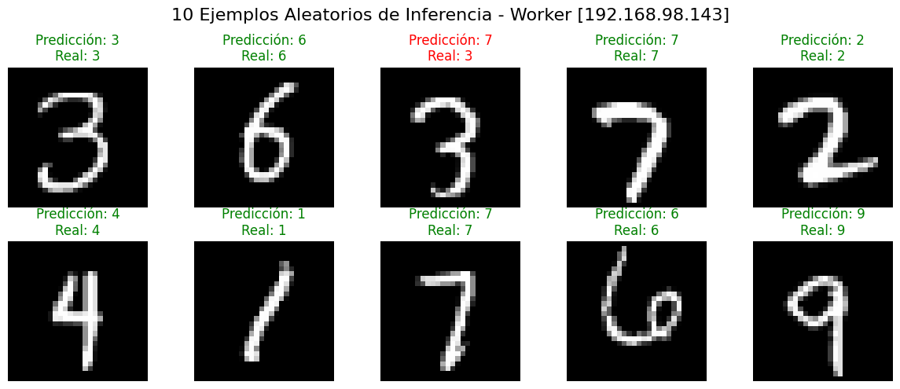

# Arquitectura de Orquestación Edge: Implementación HTTP/REST con Inteligencia Artificial

Esta sección del proyecto alberga la primera versión de la comparativa de protocolos de red para arquitecturas distribuidas en entornos Edge Computing. Esta implementación establece el *baseline* o línea de referencia utilizando el estándar de la industria web: el protocolo HTTP/1.1 con serialización JSON (texto plano) bajo un patrón arquitectónico Master-Worker.

A diferencia de pruebas de red puras, esta versión integra el ciclo de vida completo de un modelo de **Machine Learning (PyTorch)**, demostrando el comportamiento del protocolo cuando la infraestructura se somete a cargas reales de inferencia mediante Redes Neuronales Convolucionales (CNN).

## Diseño de la Arquitectura (Master-Worker)

El sistema se estructura en dos capas principales, diseñadas para separar el entrenamiento centralizado de la inferencia distribuida perimetral (Edge).

### 1. El Nodo Orquestador (Master)

El nodo central (`master.py`) actúa con una doble responsabilidad (Científico de Datos y Orquestador de Red):

* **Fase 1: Entrenamiento y Artefactos (Offline):** Antes de interactuar con la red, el Master descarga el dataset MNIST y entrena una red neuronal CNN durante 1 época. Genera automáticamente artefactos visuales (matriz de confusión y curva de aprendizaje) en la carpeta local `assets/` y guarda los pesos en el archivo binario `best_model.pth`



* **Fase 2: Distribución del Modelo (Upload):** Actúa como un servidor de despliegue, inyectando el modelo ya entrenado directamente en la memoria RAM de los nodos Workers mediante peticiones HTTP POST (envío de archivos binarios).

* **Fase 3: Partición y Serialización:** Divide las imágenes de prueba en fragmentos (*chunks*). Antes de iniciar la transmisión, el Master transforma los tensores matemáticos a listas de texto estructurado (`json.dumps()`). Esta operación se ejecuta **fuera del cronómetro de latencia**, garantizando que el RTT mida estrictamente el tiempo de red y procesamiento.

* **Fase 4: Concurrencia de Red y Validación visual:** Implementa un `ThreadPoolExecutor` para lanzar las inferencias en paralelo. Al finalizar, recolecta las métricas de los contenedores y genera un mosaico visual (`ejemplos-predicciones-http.png`) cruzando las predicciones devueltas por el Worker con las etiquetas reales.


### 2. Los Nodos Perimetrales (Workers)

Los dispositivos del clúster ejecutan contenedores *rootless* gestionados por Quadlets de Systemd, que actúan como motores de inferencia.

* **Framework API Asíncrono:** Cada contenedor expone un servidor ASGI (`Uvicorn`) orquestado por `FastAPI`.
* **Carga Dinámica del Modelo:** A través del endpoint `/upload_model`, el Worker recibe el archivo `.pth`, lo guarda físicamente y carga los "conocimientos" en la estructura de su propia CNN, poniéndola en modo evaluación (`model.eval()`).
* **Inferencia y Deserialización (El Cuello de Botella Híbrido):** La ruta `/procesar` asume un doble castigo computacional. Primero, la enorme ineficiencia de reconstruir un objeto JSON a diccionarios de Python (`await request.json()`). Segundo, la conversión de esos datos a tensores para atravesar las capas ocultas de PyTorch (`model(imagenes_tensor)`). Esto genera un cambio de paradigma empírico: el sistema pasa de estar limitado por la red (*I/O Bound*) a estar limitado por el hardware Edge (*Compute Bound*).
* **Telemetría de Alta Precisión In-situ:** Utilizando `psutil` con limpieza de buffer (`cpu_percent(interval=None)`), el Worker aísla la medición de CPU y RAM justo después del esfuerzo matemático (`torch.no_grad()`). Cronometra los milisegundos exactos invertidos ($T_{proc}$) y empaqueta las métricas en la respuesta JSON para el Master.

## Protocolo y Formato de Serialización

Esta iteración fuerza el uso de tecnologías web tradicionales en un entorno de Inteligencia Artificial distribuida:

* **Capa de Transporte (HTTP/1.1):** La comunicación se realiza mediante peticiones HTTP estándar (`requests`). Esto introduce latencia inherente debido a la negociación de cabeceras y conexiones individuales.
* **Capa de Serialización (JSON):** El formato de intercambio es texto plano. Al no soportar transmisión binaria nativa (como Protobuf o MessagePack), el envío de matrices de píxeles exige convertirlas a inmensas cadenas de texto. Esta limitación del estándar web infla el tamaño del payload de red de forma drástica (penalización de ancho de banda) y ahoga la CPU de los Workers en el *parsing* asíncrono antes de que la IA pueda siquiera empezar a predecir.

## Despliegue con Ansible

La infraestructura se aprovisiona mediante Ansible, inyectando el código de los Workers en contenedores basados en `python:3.11-slim`. Para desplegar este protocolo específico, puedes configurar el inventario por defecto o inyectar la variable de ruta en tiempo de ejecución:

```bash
# Por defecto configurado en inventario de Ansible
ansible-playbook -i inventory.ini playbook.yml

# O inyectando la variable dinámicamente
ansible-playbook -i inventory.ini playbook.yml -e "experimento_path=../2-src-protocols/01-http-json"
```

---

## Guía de Ejecución: Clúster Edge MNIST (HTTP/REST)

### 1. Preparación del Entorno (Master)

Preparar el entorno virtual del nodo orquestador con las dependencias para entrenamiento de redes neuronales, evaluación gráfica y peticiones web.

```bash
# Instalar dependencias científicas y de red en el host Master
pip install torch torchvision numpy matplotlib seaborn scikit-learn requests
```

### 2. Despliegue de Infraestructura (Ansible)

Asegúrate de que la variable `experimento_path` apunta a la carpeta de HTTP (`../2-src-protocols/01-http-json`).

```bash
# 1. Limpiar cualquier rastro previo de otros protocolos (Recomendado)
ansible-playbook -i inventory.ini clean.yml

# 2. Desplegar y arrancar el clúster inyectando el código HTTP
ansible-playbook -i inventory.ini playbook.yml -e "experimento_path=../2-src-protocols/01-http-json"
```

*(Nota: Al incluir dependencias pesadas como PyTorch en el Dockerfile, el `T_deploy` inicial será mayor de lo habitual mientras se compila la imagen en los nodos).*

### 3. Verificación en los Nodos (Workers)

Si quieres comprobar que los contenedores están corriendo bajo Systemd (modo *rootless*) y que Uvicorn está escuchando correctamente:

```bash
# Conectarse a uno de los nodos (ej. node-a)
ssh littledragon@192.168.98.143

# Ver el estado del servicio
systemctl --user status worker.service

# Ver logs en tiempo real (útil para ver las métricas de inferencia in-situ)
journalctl --user -u worker.service -f
```

### 4. Ejecución del Experimento (Master)

Una vez que los Workers estén en ejecución, lanza el script principal desde el orquestador.
El script entrenará el modelo (o usará la caché), lo enviará a los nodos, someterá el clúster a inferencia y creará las evidencias en la carpeta `/assets`.

```bash
python master.py
```