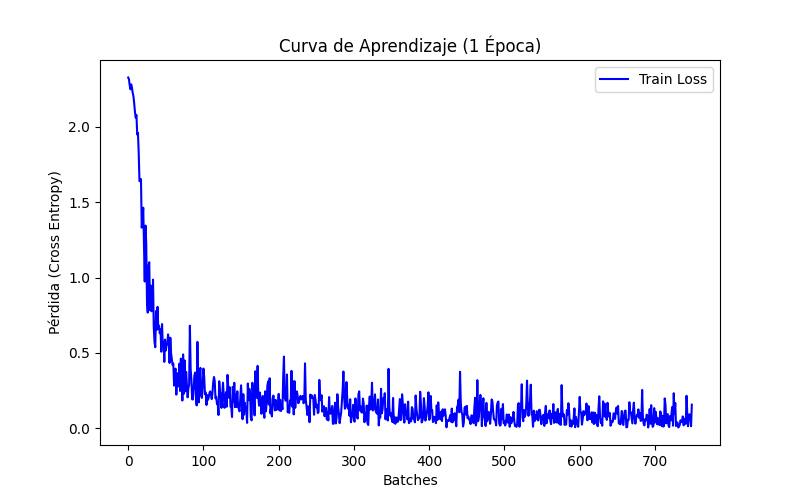
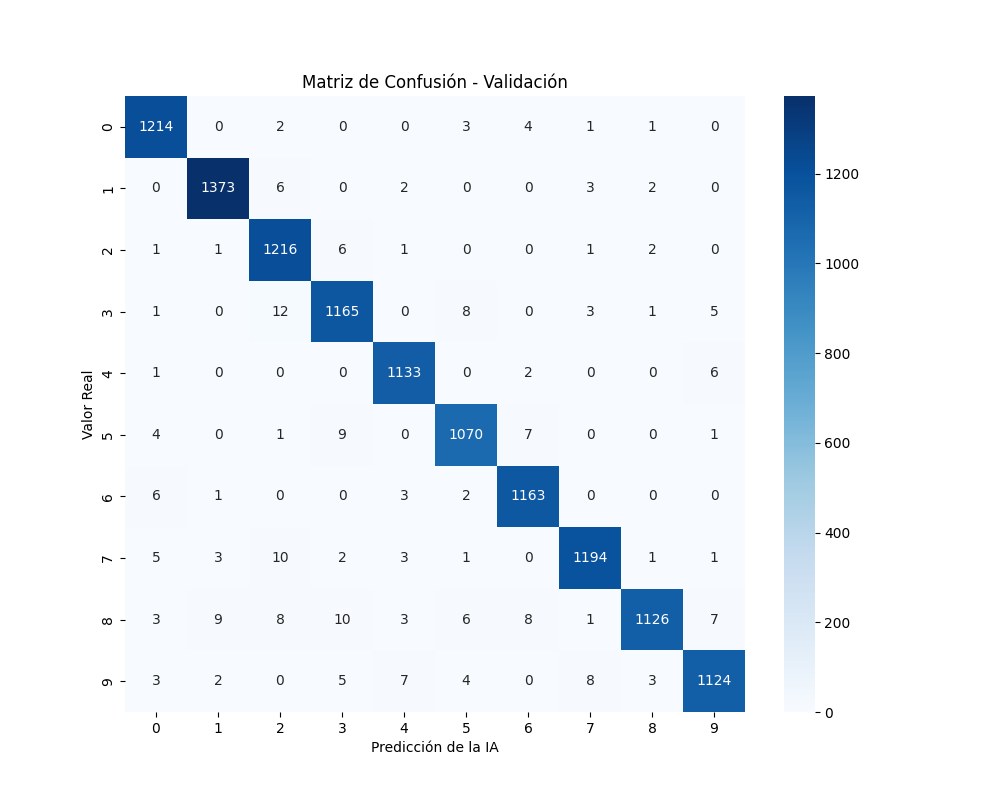
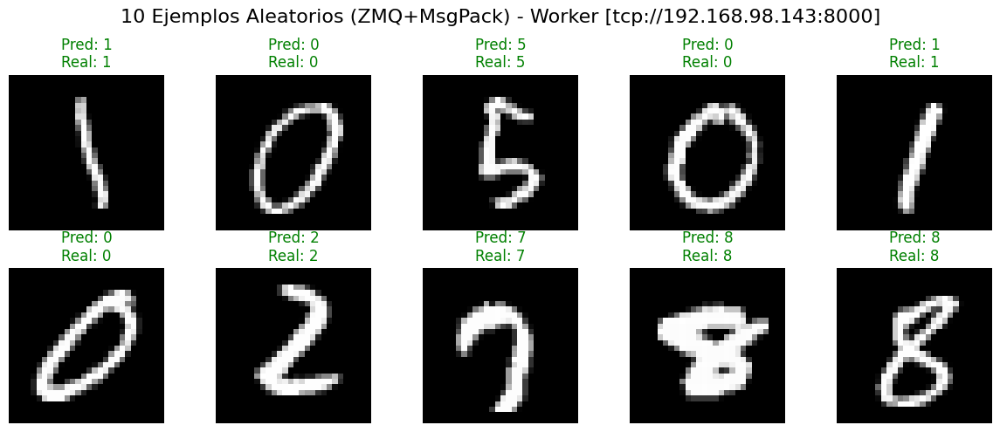

# Arquitectura de Orquestación Edge: Implementación ZeroMQ (MessagePack) con Inteligencia Artificial

Este directorio documenta la variante optimizada de la arquitectura basada en TCP crudo. Tras evaluar Protobuf, esta implementación sustituye el tipado estricto por **MessagePack**, un formato de serialización binaria *schema-less* (sin esquema).

Al igual que en las fases anteriores, esta arquitectura integra el ciclo de vida completo de un modelo de **Machine Learning (PyTorch)**. Esta combinación busca el equilibrio perfecto para ecosistemas MLOps basados en Python: la velocidad de red ultrabaja de ZeroMQ, el rendimiento de la serialización binaria, y la flexibilidad operativa de los diccionarios nativos, demostrando su comportamiento bajo escenarios de carga intensiva de CPU (*Compute Bound*).

## Diseño de la Arquitectura (Master-Worker)

El sistema mantiene el patrón de mensajería síncrona Request-Reply (REQ-REP) de ZeroMQ, pero simplifica drásticamente la estructura de los datos transmitidos al eliminar los contratos precompilados.

### 1. El Nodo Orquestador (Master)

El orquestador asume el control total de la IA y la inyección de datos a través de sockets TCP prescindiendo de compiladores externos:

* **Fase 1: Entrenamiento y Artefactos (Offline):** El Master entrena la red neuronal CNN, guarda el cerebro de la IA en `best_model.pth` y genera las métricas de rendimiento (`loss-curve.png`, `matriz-confusion.png`) en la carpeta local `assets/`.



* **Fase 2: Distribución del Modelo (Estructuración Dinámica):** A diferencia de Protobuf, que requiere instanciar clases precompiladas, el Master empaqueta los bytes del modelo `.pth` directamente en un diccionario estándar de Python (`{'model_data': model_bytes}`). Utiliza `msgpack.packb(..., use_bin_type=True)` para inyectarlo en el socket mediante mensajería multiparte (`b"UPLOAD"`).

* **Fase 3: Serialización MessagePack (Inferencia):** Para la inferencia, se repite el proceso dinámico. Se inyecta el ID del lote y el tensor binario (`particion_np.tobytes()`) en un diccionario. MessagePack comprime esta estructura dinámica a un formato binario altamente eficiente en microsegundos.

* **Fase 4: Resiliencia y Validación TCP:** Mantiene el `ThreadPoolExecutor` para la transmisión paralela y la inyección del *timeout* (`zmq.RCVTIMEO`) para proteger al orquestador. Al finalizar, extrae 10 muestras aleatorias y genera el mosaico visual de validación (`ejemplos-predicciones-msgpack.png`).


### 2. Los Nodos Perimetrales (Workers)

Los contenedores *rootless* mantienen el bucle de escucha asíncrono en el puerto 8000 gestionado nativamente por `pyzmq`, incorporando defensas a nivel de memoria:

* **Desbordamiento de Límites (Buffer Limits):** Por defecto, las librerías de MessagePack imponen límites estrictos de seguridad para prevenir ataques de agotamiento de memoria (OOM). Dado que los tensores de PyTorch y el propio modelo `.pth` son pesados, el Worker sobrescribe explícitamente estos límites durante la deserialización mediante el parámetro `max_bin_len=200*1024*1024`.
* **Carga Dinámica en RAM:** Al recibir el comando `UPLOAD`, el Worker extrae el binario del diccionario desempaquetado, lo guarda en disco y lo transfiere a la VRAM/RAM de la CNN de PyTorch (`model.eval()`).
* **Zero-Copy Sostenido y Cálculo:** Tras desempaquetar la petición `INFER`, el Worker recupera el acceso al tensor mediante la clave dinámica (`data['image_data']`) y aplica la técnica de copia cero (`np.frombuffer`) para asignar el bloque de memoria RAM directamente a la IA, invirtiendo todo el esfuerzo de la CPU en el cálculo matemático (`torch.no_grad()`).
* **Telemetría y Control de Errores:** Se mide el esfuerzo computacional real ($T_{proc}$, RAM y CPU) aislando el PID. Además, esta variante implementa un bloque `try/except` que captura cualquier error y devuelve un estado de `ERROR` encapsulado en MessagePack, garantizando que el clúster no colapse ante paquetes corruptos.

## Análisis del Protocolo: Flexibilidad vs. Contratos Estrictos

Esta implementación representa el extremo opuesto a gRPC en términos de filosofía de desarrollo. Mientras gRPC prioriza la robustez inter-lenguaje mediante contratos estrictos, esta variante prioriza la **agilidad operativa para ecosistemas de IA**:

* **Capa de Transporte (TCP Crudo):** Al operar sobre sockets TCP puros, eliminamos la capa de abstracción HTTP/2, reduciendo la negociación de cabeceras, lo cual es óptimo para comunicaciones de baja latencia.
* **Capa de Serialización (MessagePack):** El uso de un formato *schema-less* elimina el acoplamiento rígido entre el Master y los Workers Edge. Esto permite modificar las métricas enviadas o la estructura del payload simplemente añadiendo llaves al diccionario de Python en el Master, sin necesidad de recompilar y redesplegar el código de los Workers.

**Ventajas operativas de esta arquitectura:**

* **Desacoplamiento total de compiladores:** Al eliminar la dependencia de `grpcio-tools` y los archivos `.proto`, se reduce significativamente la complejidad del `Dockerfile` y el tiempo de *build* de la imagen del contenedor IA.
* **Integración Nativa Python/ML:** La combinación dict-MsgPack se alinea a la perfección con el flujo de trabajo natural de un Científico de Datos (NumPy, PyTorch, Pandas).

## Despliegue con Ansible

La provisión del entorno inyecta la ruta de este protocolo específico. Al no requerir fase de compilación interna del esquema, el *build* de Podman orquestado por Systemd es directo.

```bash
# Desplegar inyectando la ruta de ZMQ+MsgPack
ansible-playbook -i inventory.ini playbook.yml -e "experimento_path=../2-src-protocols/04-zeromq-messagepack"
```

---

## Guía de Ejecución: Clúster Edge MNIST (ZMQ + MessagePack)

### 1. Preparación del Entorno (Master)

El nodo central se libera de los compiladores, requiriendo únicamente las librerías científicas, de comunicación y serialización.

```bash
# Instalar dependencias necesarias (¡Sin necesidad de compilar nada!)
pip install pyzmq msgpack numpy psutil torch torchvision matplotlib seaborn scikit-learn
```

### 2. Despliegue de Infraestructura (Ansible)

Asegúrate de inyectar la variable de ruta para que Ansible tome los archivos de la carpeta correspondiente a esta variante.

```bash
# 1. Limpieza de contenedores previos (Obligatorio para liberar el puerto 8000)
ansible-playbook -i inventory.ini clean.yml

# 2. Despliegue de la imagen de ZeroMQ + MessagePack
ansible-playbook -i inventory.ini playbook.yml -e "experimento_path=../2-src-protocols/04-zeromq-messagepack"
```

### 3. Verificación en los Nodos (Workers)

Conéctate por SSH a los nodos Edge para validar que el servicio está levantado y el socket TCP está expuesto esperando los tensores.

```bash
# Conectarse al nodo
ssh littledragon@192.168.98.143

# Ver el estado del servicio gestionado por Systemd
systemctl --user status worker.service

# Ver logs (debe indicar "Iniciando Worker Edge IA (ZeroMQ + MessagePack) en puerto 8000...")
journalctl --user -u worker.service -f
```

### 4. Ejecución del Experimento (Master)

Con los Workers listos, ejecuta el orquestador principal. El script entrenará a la IA, mandará los pesos por ZeroMQ, someterá el clúster a inferencia masiva y extraerá las analíticas finales.

```bash
python master.py
```
