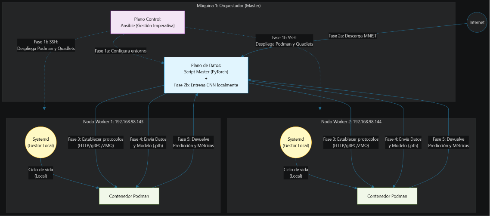
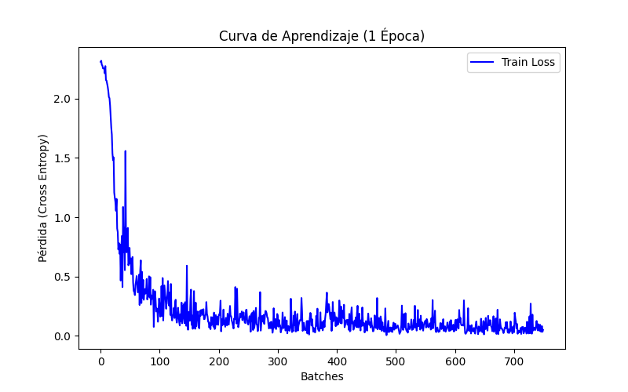
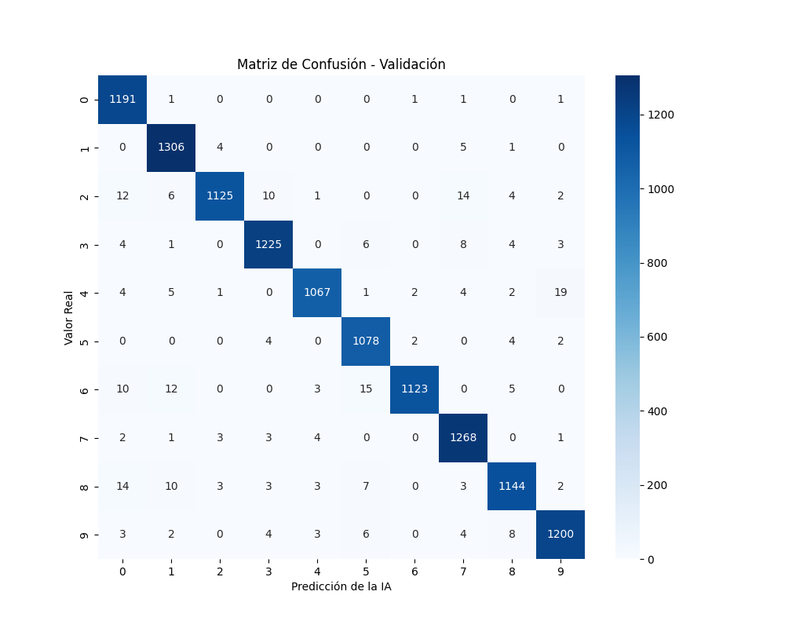

# Orchestration Trade-offs in Edge Computing: systemd vs Kubernetes

Edge environments challenge conventional cloud-native orchestration models due to limited resources and simplified deployment requirements. This work analyzes the trade-offs between Kubernetes and systemd as orchestration solutions for edge nodes. Using a set of representative workloads and fault-injection experiments, the study evaluates performance, resilience, and management complexity, offering design insights for selecting appropriate orchestration mechanisms in edge computing scenarios.

---

# Informe de Seguimiento: Comparativa de Systemd + podman

El objetivo de esta entrega consiste en hacer la comparativa de diferentes protocolos de comunicaciones en Systemd + podman para una misma tarea y obtener las métricas y números.

La tarea consiste en procesar el dataset MNIST distribuido en N partes hacia N nodos hijos. En esta iteración avanzada, el procesamiento ha evolucionado de un simple conteo a un **ciclo de vida completo de MLOps (Machine Learning Operations)**, donde el Master entrena una Inteligencia Artificial y los nodos Edge ejecutan la inferencia.

---

## Índice

1. Resumen Ejecutivo
2. Infraestructura
3. Resumen de Fases del trabajo
4. Comparativa protocolos de comunicación
5. Métricas evaluadas
6. Resultados de la Evaluación Técnica
7. Análisis y Conclusiones

---

## 1. Resumen Ejecutivo

Tras la consolidación de la infraestructura base orquestada mediante systemd, esta fase del proyecto se ha centrado en evaluar la viabilidad de la comunicación de datos masivos en el Edge.

Se implementó inicialmente un sistema basado en el estándar web (**HTTP/REST con JSON**) que reveló severos cuellos de botella en memoria y latencia.

Esto motivó un cambio de paradigma arquitectónico hacia la **serialización binaria**, implementando y comparando dos soluciones avanzadas: **gRPC (sobre HTTP/2)** y **ZeroMQ (sobre TCP crudo, P2P)**.

Simultáneamente, se ha refactorizado el despliegue con Ansible para soportar estas arquitecturas de forma modular y se ha integrado un flujo científico real de IA para garantizar que las pruebas de estrés (Benchmarks) se realicen sobre un escenario realista, aislando las variables de red del procesamiento neuronal.

---

## 2. Especificaciones de Infraestructura

* **Entorno**:
    * Máquina virtual VMware con 2 nodos worker/hijos Ubuntu 24.04.4
    * Un nodo master/padre en Ubuntu 22.04.5 en Windows 11 via wsl

* **Orquestador de Despliegue:** Ansible 2.10+ en nodo master
* **Gestor de Contenedores:** Podman 4.5+ (Modo Rootless)
* **Supervisor de Servicios:** systemd
* **Dataset:** TensorFlow Datasets (MNIST - 60,000 imágenes de entrenamiento)

---

## 3. Resumen de fases del trabajo y del desarrollo

El sistema orquestador ejecuta ahora un flujo altamente diferenciado para garantizar la validez científica del experimento:

### Fase 1: Aprovisionamiento y Control (Ansible)

* **Mecanismo:** SSH.
* **Acción:** El nodo máster se conecta por SSH a los workers, despliega los archivos Quadlet, hace el `systemctl daemon-reload` y levanta los servicios.

### Fase 2: Entrenamiento y Validación MLOps (Offline)

* **Mecanismo:** Procesamiento local en el Master (PyTorch).
* **Acción:** El Master descarga el dataset MNIST. En lugar de limitarse a dividirlo, entrena una Red Neuronal Convolucional (CNN) fundacional. Una vez validada, la "inteligencia" se guarda en el artefacto binario `best_model.pth`.

> **Certificación del Modelo (Fase de Entrenamiento)**
> 
> 
> *Fig 1: Caída del error de entrenamiento por lotes durante la única época de ejecución.*
> 
> 
> *Fig 2: Matriz de confusión resultante evaluando las imágenes de validación.*

> **Justificación del Entrenamiento de 1 Época:**
> Para la evaluación del sistema, el entrenamiento de la CNN se configuró deliberadamente para ejecutarse durante una única época (1 Epoch). Esta decisión arquitectónica se fundamenta en tres criterios clave:
> 1. **Alcance del Proyecto:** El objetivo principal de este estudio es aislar y cuantificar el rendimiento de los protocolos de comunicación en arquitecturas Edge, no la optimización de hiperparámetros en modelos de Deep Learning.
> 2. **Evidencia de Convergencia:** Como se observa en la curva de aprendizaje (medida por lotes/batches), el error de entrenamiento (*Train Loss*) experimenta una caída drástica y se estabiliza antes de finalizar la primera iteración completa del dataset.
> 3. **Eficiencia Computacional:** Al finalizar esta única época, el modelo alcanza una precisión de validación (*Validation Accuracy*) que ronda el 97-98%. Este nivel de acierto es prueba empírica suficiente para certificar que el pipeline de inferencia y la transmisión de tensores funcionan correctamente de extremo a extremo, evitando un consumo innecesario de tiempo en el nodo Master.

### Fase 3: Distribución del Cerebro IA y Procesamiento (Padre -> Hijos)

* **Mecanismo:** Comparativa del stack de red (Podman) usando los diferentes protocolos.
* **Acción:** Para garantizar el control de variables, todos los Workers reciben primero exactamente la misma arquitectura y pesos neuronales (`best_model.pth`). Posteriormente, el nodo master manda las imágenes a inferir mediante HTTP, gRPC o ZeroMQ, con su correspondiente formato de serialización (JSON, Protobuf, MessagePack).

### Fase 4: Retorno de Resultados y Métricas (Hijos -> Padre)

* Nodos hijos generan un reporte de telemetría (CPU, RAM, T_proc) junto con las predicciones y lo devuelven al nodo padre usando el patrón de respuesta propio de cada protocolo (ej. respuesta HTTP 200 OK, gRPC Unary Call o ZMQ REP socket).

---

## 4. Comparativa y experimento

#### Comparativa de protocolo

* HTTP/v1.1 + json
* HTTP/2 + binario - protobuf (gRPC)
* ZeroMQ + binario - protobuf

#### Comparativa de formato de envio de datos

* ZeroMQ + binario - protobuf
* ZeroMQ + binario - MessagePack

### 1. La Línea Base (El estándar a batir)

* **Prueba:** `HTTP/1.1 + JSON`
* **Por qué:** Es obligatorio tenerlo. Necesitas demostrar empíricamente lo ineficiente que es enviar texto plano con cabeceras pesadas en un entorno *Edge*.

### 2. El Estándar Moderno de Microservicios

* **Prueba:** `gRPC (HTTP/2 + Protobuf)`
* **Por qué:** Es el ciudadano de primera clase en Kubernetes. Medir su rendimiento casi perfecto en Systemd te dará un contraste brutal cuando lo midas en K3s y veas cuánto penaliza la capa de red virtual (CNI).

### 3. El Rendimiento Crudo (Brokerless)

* **Prueba:** `ZeroMQ + Protobuf`
* **Por qué:** Representa el límite físico de la máquina. Al no haber un servidor intermedio (broker), se aísla y mide el rendimiento del *stack* de red de Podman en estado puro.

### 4. La "Batalla" de la Serialización

* **Prueba:** `ZeroMQ + MessagePack`
* **Por qué:** En lugar de probar MessagePack en *todos* los protocolos, lo hacemos en uno solo para visualizar el *"Impacto de la serialización con esquema (Protobuf) vs. sin esquema (MessagePack)"*.

> **Nota sobre protocolos asíncronos:** Durante la fase de diseño, se evaluó la inclusión de protocolos basados en intermediarios (Broker) como MQTT o AMQP. Sin embargo, se descartaron. La topología de un Broker impone un modelo de "doble salto" que introduce latencia física extra y enmascara el rendimiento real de la capa de red subyacente. Se ha priorizado el uso exclusivo de comunicaciones directas punto a punto.

---

### El Cambio de Paradigma: De Texto Plano (JSON) a Binario

* **El Cuello de Botella (JSON):** Transmitir tensores matemáticos obligaba a convertirlos a texto plano. Al recibir el *payload*, el nodo Worker colapsaba su memoria RAM intentando parsear el gigantesco archivo de texto para reconstruir los diccionarios lógicos.
* **La Solución Binaria (Protobuf/MsgPack):** Permite empaquetar los datos en crudo (`bytes`). Al llegar al nodo, se utiliza una técnica de *zero-parsing* (`np.frombuffer`), volcando los bytes directamente a la memoria de la CPU sin intermediarios, liberando los recursos del sistema.

---

## 5. Métricas evaluadas

### 1. Plano Científico IA (Calidad del Modelo)

* *Validation Accuracy* (Precisión con datos nuevos) [%]
* Evolución de *Train Loss* (Detección de aprendizaje por lotes).

### 2. Aprovisionamiento (Plano de Control)

* Tiempo de despliegue total ($T_{deploy}$) [s]
* Tráfico de red de inicialización [MB]

### 3. Orquestación y Ciclo de Vida (Plano de Gestión)

* Consumo de RAM en reposo [MB]
* Consumo de CPU en reposo [%]
* Tiempo de arranque de servicios ($T_{setup}$) [ms]

### 4. Trabajo de Red y Procesamiento (Plano de Datos)

* Tamaño del Payload (JSON/Protobuf/MsgPack) [B o KB]
* Latencia RTT de la tarea [ms]
* Tiempo de procesamiento matemático en nodo worker ($T_{proc}$) [ms]
* Throughput efectivo [img/s]
* Pico máximo de RAM durante el estrés [MB]
* Consumo promedio de CPU durante la transmisión [%]

---

## 6. Resultados de la Evaluación Técnica (`resultados_tablas.md`)

Se han realizado pruebas de estrés enviando un lote continuo de 60.000 imágenes a los nodos Edge. *(Nota: La Matriz de Confusión y Curvas de Aprendizaje generadas en la Fase 2 se documentan en los artefactos individuales de cada prueba para certificar el estado del modelo).*

Para ver resultados de la comparativa de red, pulsa [aquí](/entrega-3/3-benchmarks-results/resultados-tablas.md).

---

## 7. Análisis Final y Conclusiones

**Integridad del Pipeline MLOps y Rendimiento de Red**

Antes de evaluar el rendimiento bruto de los protocolos de comunicación perimetral, era imperativo certificar la viabilidad operativa y la integridad de los datos en el sistema distribuido. Tras una única época de entrenamiento en el nodo Master, el modelo fundacional alcanzó un óptimo *Validation Accuracy* (superior al 97%). 

Como se evidenció en las Matrices de Confusión, las inferencias ejecutadas en los nodos Edge arrojaron resultados matemáticamente coherentes. Este hito es crucial para el experimento: demuestra empíricamente que la partición del dataset y la transmisión de tensores mediante técnicas avanzadas de serialización binaria preservan la integridad absoluta del *payload*. 

Al tener garantizada la fiabilidad algorítmica en los extremos del sistema, el estudio pudo aislar con precisión la eficiencia de la capa de transporte. Bajo estas condiciones de control con datos históricos consolidados, se concluye que:

1. **Inviabilidad del estándar REST/JSON:** El *baseline* (HTTP/JSON) resultó ser ineficiente para el tráfico de tensores. El uso de texto plano infló el tamaño del payload a **15.59 MB** (un 420% más que las alternativas binarias), alcanzando un pico de memoria de **335.23 MB de RAM** y limitando el throughput a unas deficientes **1.845 img/s**. Se confirma que los estándares web tradicionales introducen una penalización por serialización inasumible para dispositivos Edge.
2. **La revolución binaria (gRPC/Protobuf):** El salto a gRPC no fue solo una mejora, sino un cambio de paradigma. Al eliminar la serialización de texto y usar *Protobuf* (payload de **2.99 MB**), el throughput aumentó en más de un 260% (alcanzando las **4.923 img/s** promedio) y la huella de memoria se redujo a **311.71 MB**, validando la serialización binaria como requisito indispensable.
3. **Optimización de la capa de transporte (ZeroMQ):** Al prescindir de las pesadas cabeceras HTTP/2 y pasar a sockets TCP crudos con ZeroMQ, la latencia RTT promedio cayó a su mínimo absoluto de **458.74 ms** (frente a los 722 ms de HTTP). Esta arquitectura superó las **5.300 img/s** de media, con picos aislados de rendimiento de hasta 9.400 img/s en entornos controlados, demostrando que la pila de red de gRPC añade un *overhead* evitable mediante túneles directos.
4. **La superioridad de MessagePack (Eficiencia Dinámica):** La iteración con ZeroMQ + MessagePack representa el límite teórico del sistema en cuanto a optimización de recursos. Aunque mantiene un throughput similar a Protobuf (**5.127 img/s**), esta arquitectura minimiza el consumo máximo de RAM a solo **269.69 MB**. El uso de un formato *schema-less* ha demostrado ser más eficiente que el tipado estricto de Protobuf, al eliminar el coste computacional y de memoria que exige instanciar clases precompiladas complejas en el nodo Worker.

La optimización del sistema Edge no reside únicamente en la orquestación mediante `systemd/podman`. La tríada **ZeroMQ + MessagePack + Zero-Copy** se establece como la arquitectura ganadora, logrando un equilibrio sin precedentes entre rendimiento bruto, latencia mínima y agilidad de desarrollo.