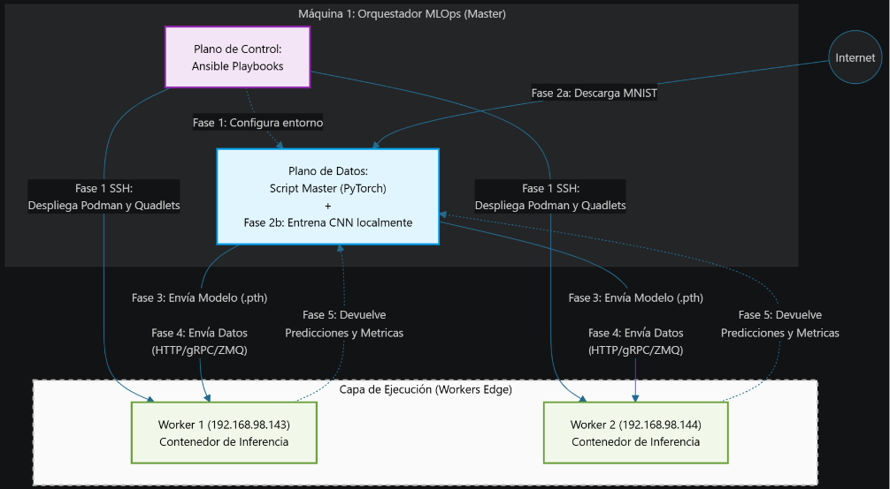
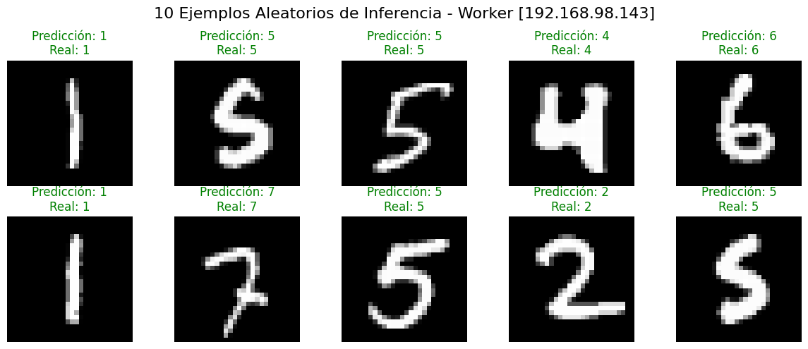
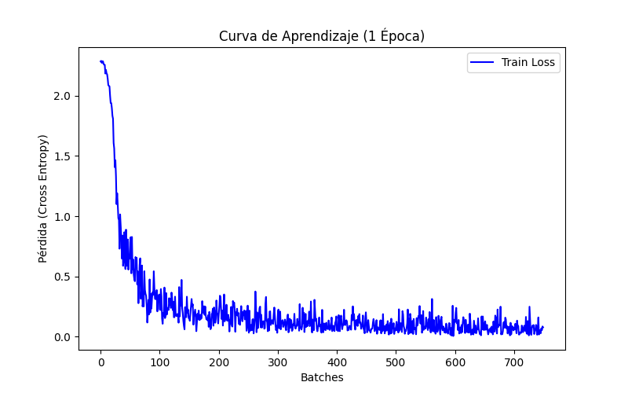
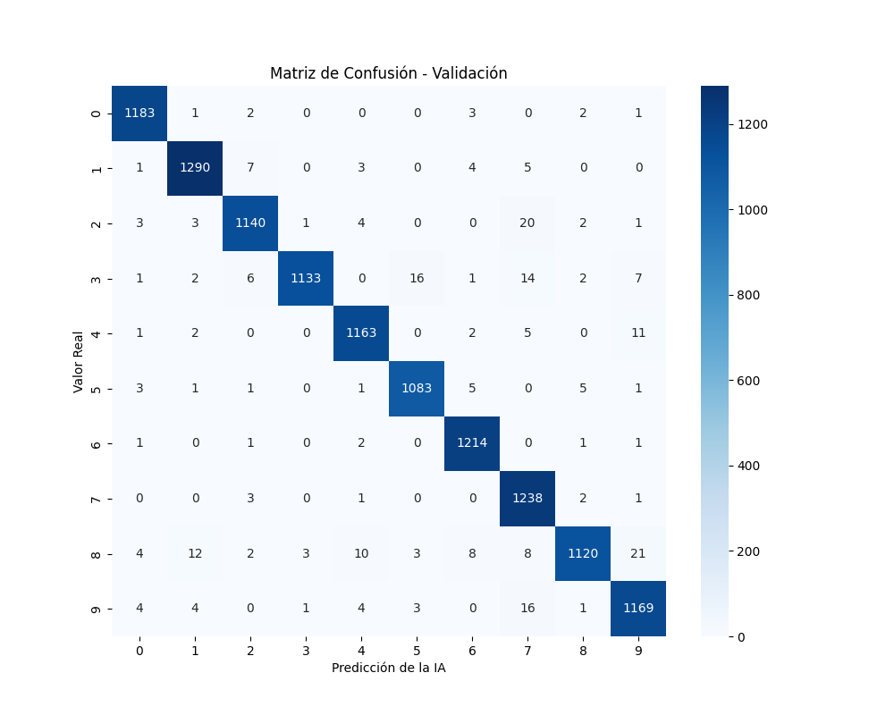
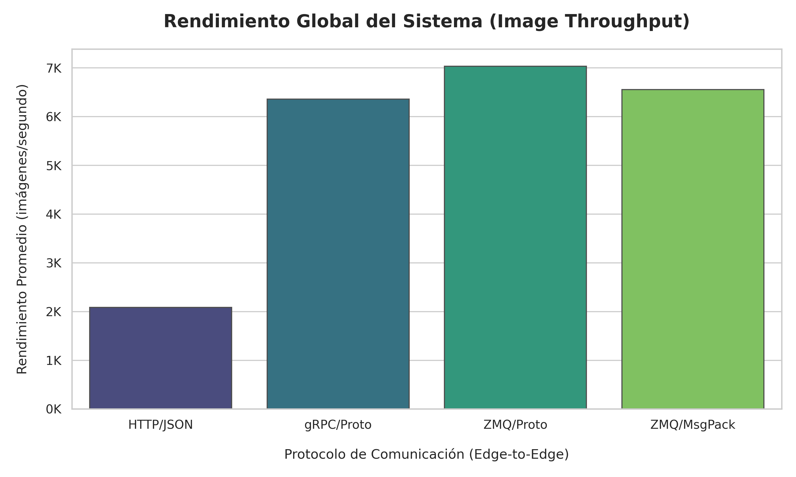
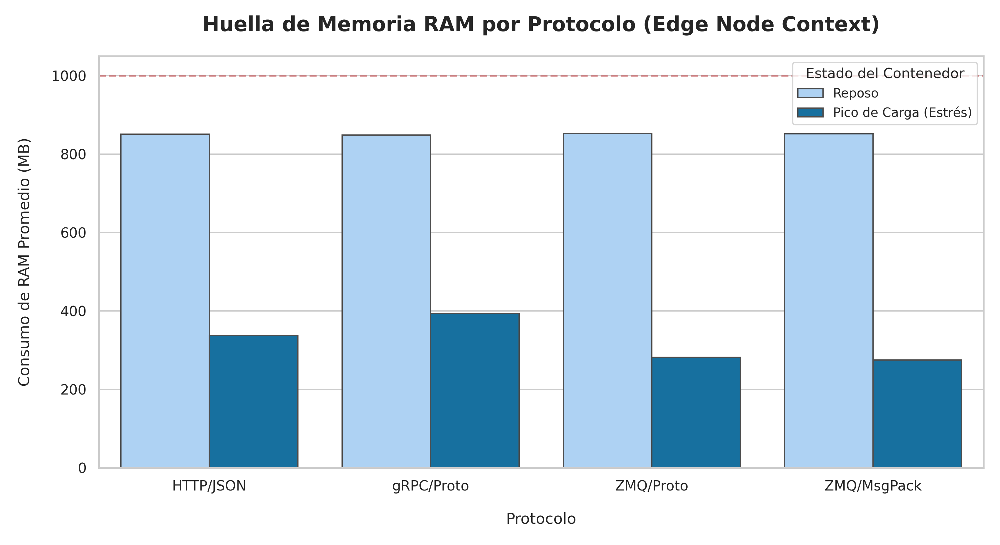
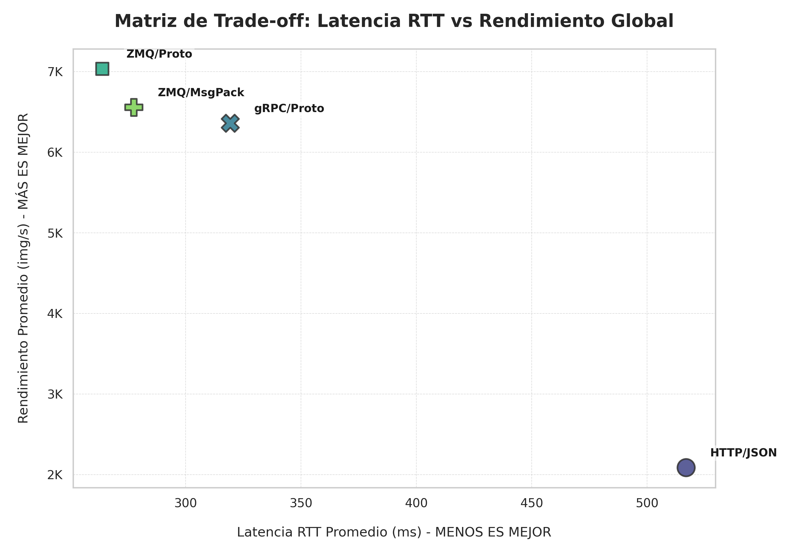

# Orchestration Trade-offs in Edge Computing: systemd vs Kubernetes

Edge environments challenge conventional cloud-native orchestration models due to limited resources and simplified deployment requirements. This work analyzes the trade-offs between Kubernetes and systemd as orchestration solutions for edge nodes. Using a set of representative workloads and fault-injection experiments, the study evaluates performance, resilience, and management complexity, offering design insights for selecting appropriate orchestration mechanisms in edge computing scenarios.

---

# Informe Final: Comparativa Arquitectónica y Benchmarking MLOps

El objetivo de este proyecto es analizar el impacto y los *trade-offs* de migrar de un modelo de gestión imperativa y local (**Systemd + Podman**) a un orquestador distribuido y declarativo (**Kubernetes/K3s + containerd**) en dispositivos de frontera (*Edge Computing*).

La tarea evaluada consiste en un **ciclo de vida completo de MLOps**, donde un nodo Master entrena un modelo de IA (CNN) y distribuye la carga de inferencia del dataset MNIST hacia los nodos Edge. Para estresar la red de Kubernetes, se han contrastado múltiples protocolos de comunicación y formatos de serialización binaria.

---

## Índice

1. Resumen Ejecutivo
2. Infraestructura
3. Resumen de Fases del trabajo
4. Resultados de la Evaluación Técnica
5. Análisis y Conclusiones

---

## 1. Resumen Ejecutivo

Tras consolidar una línea base de rendimiento mediante Systemd, esta fase del proyecto despliega la misma infraestructura de Inteligencia Artificial sobre un clúster **Kubernetes (K3s)**.

La adopción de Kubernetes resuelve el problema de la alta disponibilidad y el enrutamiento manual al abstraer la infraestructura en un plano de control central. Sin embargo, el análisis empírico revela un **"Impuesto Arquitectónico"** significativo: el mantenimiento del clúster impone una severa penalización en el consumo de memoria RAM.

Para mitigar los cuellos de botella introducidos por la capa de red virtual (CNI) de Kubernetes, se ha abandonado el estándar web (HTTP/JSON) migrando hacia túneles de comunicación basados en **gRPC** y **ZeroMQ** con serialización binaria (**Protobuf** y **MessagePack**), alcanzando el límite físico de rendimiento del hardware subyacente.

---

## 2. Especificaciones de Infraestructura

* **Entorno**: Máquina virtual VMware con 2 nodos worker (Ubuntu 24.04.4) y 1 nodo master (Ubuntu 22.04.5 vía WSL en Windows 11).
* **Plano de Automatización (Aprovisionamiento):** Ansible 2.10+
* **Plano de Orquestación:** Kubernetes ligero (K3s API Server)
* **Gestor de Contenedores / Plano de Datos:** containerd + Kubelet
* **Red Virtual (CNI):** Flannel + Kube-proxy
* **Dataset:** TensorFlow Datasets (MNIST - 60,000 imágenes)

---

## 3. Resumen del Flujo de Ejecución (Pipeline)

La arquitectura opera bajo una estricta separación de planos de control y de datos:

### Fase 1: Aprovisionamiento Híbrido (Ansible + K3s)

* **1a y 1b (Out-of-band):** Ansible se conecta por SSH directamente al host físico de los workers. Implementando un patrón **Air-Gapped**, inyecta las imágenes `.tar` pesadas directamente en el motor `containerd` local para evitar saturar el ancho de banda del clúster.
* **1c (Traspaso de Poder):** Ansible aplica el manifiesto YAML contra la API de K3s. A partir de este momento, Ansible se retira y Kubernetes asume la soberanía del ciclo de vida y la resiliencia mediante su *Reconciliation Loop*.

### Fase 2: Entrenamiento MLOps (Offline)

El Master descarga el dataset MNIST y entrena una Red Neuronal Convolucional (1 Epoch). Se genera el artefacto binario `best_model.pth` garantizando un *Validation Accuracy* superior al 97%.

*Fig 1: Ejemplos de predicciones del modelo entrenado.*

> **Certificación del Modelo (Fase de Entrenamiento)**
> 
> 
> *Fig 2: Caída del error de entrenamiento por lotes durante la única época de ejecución.*
> 
> 
> *Fig 3: Matriz de confusión resultante evaluando las imágenes de validación.*

### Fases 3 y 4: Enrutamiento Delegado (Flujo de Ida)

El script Master distribuye las imágenes a inferir hacia el clúster. Al desconocer las IPs efímeras de los Pods, el tráfico se dirige al `Service NodePort` de Kubernetes, que actúa como balanceador de carga utilizando protocolos HTTP/2, gRPC o ZMQ.

### Fase 5: Retorno Egress (Flujo de Vuelta)

Los workers ejecutan la inferencia y retornan las predicciones y métricas de telemetría (CPU, RAM). Este flujo de vuelta es directo hacia la IP estática del nodo orquestador, minimizando la carga en el plano de control de K3s.

---

## 4. Resultados Consolidados y Benchmarking

Se ha sometido al clúster K3s a pruebas de estrés continuas procesando 60.000 imágenes. Los siguientes datos representan las medias históricas de rendimiento:

### El Coste de Orquestación (Kubernetes en Reposo)

A diferencia de la arquitectura basada en Systemd, Kubernetes exige un peaje base elevado:

* **Consumo RAM en reposo (Promedio):** ~850 MB por nodo.
* **Consumo CPU en reposo:** 1.00% - 1.30%.
* *Nota:* Este consumo de memoria es exclusivo para mantener vivo el *heartbeat* y el plano de red, lo que deja márgenes estrechos para la IA en hardware IoT (ej. Raspberry Pi 1GB/2GB).

### Rendimiento de Red y Serialización (Bajo Estrés)

| Arquitectura en K3s | Payload Red | Latencia RTT | Throughput | RAM Max (Estrés) |
| --- | --- | --- | --- | --- |
| **01. HTTP/1.1 + JSON** | 15.59 MB | 516.90 ms | 2.086 img/s | 337.30 MB |
| **02. gRPC + Protobuf** | 2.99 MB | 319.32 ms | 6.358 img/s | 392.79 MB |
| **03. ZeroMQ + Protobuf** | 2.99 MB | 263.80 ms | **7.033 img/s** | 289.77 MB |
| **04. ZeroMQ + MessagePack** | 2.99 MB | **233.67 ms** | 6.555 img/s | **268.55 MB** |

### Resumen Visual de Rendimiento

Para ilustrar la drástica penalización del estándar web frente a la serialización binaria en dispositivos con recursos restringidos, se exponen las siguientes gráficas consolidadas:

*Fig 6: Comparativa de Throughput (Imágenes por segundo). La transición de JSON a formatos binarios supone un incremento del rendimiento superior al 260%.*

*Fig 7: Huella de memoria RAM en los nodos Edge. La línea de referencia (1000 MB) simula el límite de un dispositivo perimetral estándar (ej. Raspberry Pi 1GB). Se observa cómo ZMQ/MsgPack minimiza el impacto durante la inferencia (Pico de Carga) en comparación con el costoso parseo de texto de HTTP/JSON.*

*Fig 8: Matriz de Trade-off (Latencia RTT vs Throughput). Se evidencia cómo HTTP/JSON queda aislado como un anti-patrón para el Edge (alta latencia, bajo rendimiento), mientras que las implementaciones sobre ZeroMQ y gRPC convergen en el cuadrante de eficiencia óptima.*

---

## 5. Conclusión y Trade-Offs

El análisis estadístico sobre Kubernetes evidencia que **los estándares web tradicionales (HTTP/JSON) son inviables para el procesamiento de tensores masivos en el Edge**, generando cuellos de botella severos que anulan las ventajas del orquestador distribuido.

Tras la migración arquitectónica, se concluyen tres principios fundamentales para entornos Edge:

1. **El "Impuesto Arquitectónico" es ineludible:** La abstracción de red, el enrutamiento lógico y la auto-recuperación que ofrece Kubernetes (K3s) penalizan a los dispositivos perimetrales con un consumo en vacío de ~850 MB de RAM. Cuando se opera en hardware limitado, elegir el protocolo de datos correcto determina si el clúster sobrevive o colapsa por falta de memoria (OOM).
2. **La serialización binaria es innegociable:** Al abandonar el texto plano (JSON), el payload se comprimió de 15.59 MB a menos de 3 MB. Esto permitió que gRPC y ZeroMQ triplicaran el rendimiento del clúster de K3s, reduciendo la latencia de red casi a la mitad y mitigando el *overhead* introducido por el Service NodePort.
3. **Trade-off Final (Rendimiento vs Mantenibilidad):**
* **Systemd** proporciona un entorno de ejecución crudo, ultraligero y de máximo rendimiento, pero exige una gestión imperativa frágil.
* **Kubernetes (K3s)** unifica la orquestación, pero requiere una optimización extrema del flujo de datos. Dentro de este clúster:
* *ZeroMQ + Protobuf* es la opción elegida si se busca la victoria absoluta en rendimiento bruto (**7.033 img/s**).
* *ZeroMQ + MessagePack* se consolida como la arquitectura MLOps óptima en el mundo real. Cede un margen insignificante de velocidad, pero genera el menor impacto de RAM (268 MB) bajo estrés, balanceando perfectamente las exigencias de memoria de Kubernetes con el procesamiento de IA.